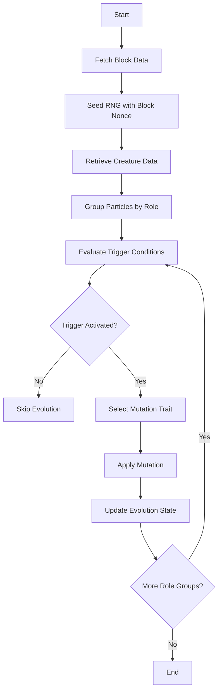
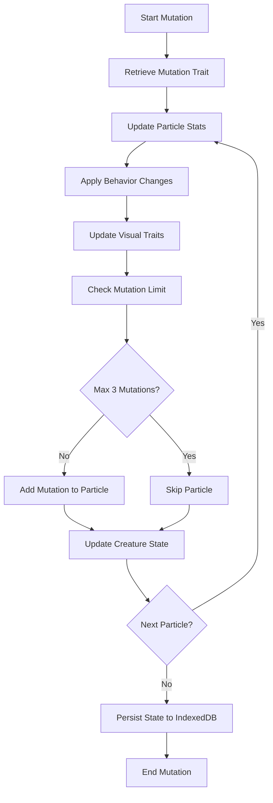
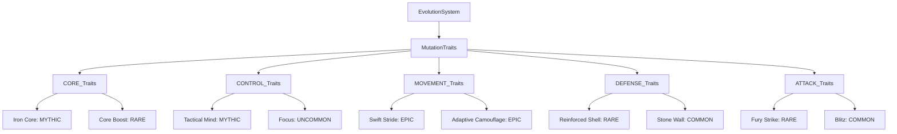
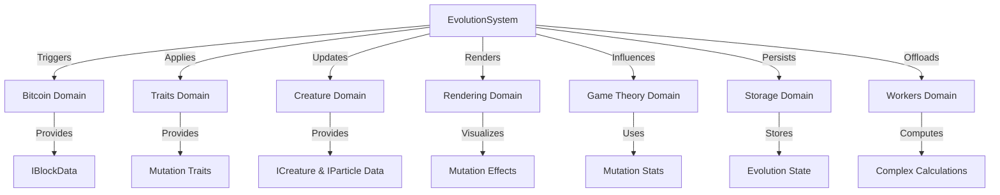

# Evolution System Diagrams

## Purpose
This document provides visual aids to illustrate the structure, workflows, and interactions of the evolution system in Bitcoin Protozoa, specifically tailored to its particle-based design, role-specific mechanics (CORE, CONTROL, MOVEMENT, DEFENSE, ATTACK), extensive mutation trait system with over 200 traits [Timestamp: April 12, 2025, 12:18], and deterministic RNG driven by Bitcoin block data. It serves as a single source of truth for developers and contributors, enhancing comprehension through graphical representations of trigger activation, mutation application, and system integrations, supporting the project’s domain-driven design (DDD) principles and facilitating migration from the current GitHub structure (https://github.com/BTCEnoch/Protozoa/tree/main) to the new framework.

## Location
`new_docs/systems/evolution/evolution_diagrams.md`

## Overview
The evolution system drives creature adaptation through triggers (e.g., block confirmations), mutation trait generation, and state management, influencing stats, behaviors, visuals, and strategic outcomes for creatures with up to 500 particles. Managed by `evolutionService.ts`, `traitService.ts`, and `evolutionTracker.ts`, the system ensures deterministic changes using block nonce-seeded RNG and robust state handling with Zustand and IndexedDB [Timestamp: April 16, 2025, 21:41]. This document includes flowcharts for trigger activation and mutation application workflows, diagrams of mutation trait hierarchies by rarity, and visuals of system interactions, using Mermaid syntax for clarity.

## Flowchart: Trigger Activation Workflow
This flowchart illustrates the process of evaluating and activating evolutionary triggers for a creature.



- **Description**: The workflow begins by fetching `IBlockData` (e.g., nonce, confirmations) from `bitcoinService.ts` to seed the RNG for determinism. Creature data (`ICreature` and `IParticle[]`) is retrieved, and particles are grouped by role (e.g., 100 DEFENSE particles) using `evolutionService.ts`. Trigger conditions (e.g., block confirmations, damage absorbed) are evaluated, and if activated, a mutation trait is selected via `traitService.ts`. The mutation is applied to the role group, and the evolution state is updated in `evolutionTracker.ts`, with changes persisted to IndexedDB.

## Flowchart: Mutation Application Workflow
This flowchart shows how mutation traits are applied to particles or creatures.



- **Description**: Upon trigger activation, `traitService.ts` retrieves the mutation trait (e.g., “Fury Strike”). Particle stats (e.g., damage +25) are updated, behavior changes (e.g., “Aggressive” synergy) are applied, and visual traits (e.g., red glow) are set via `visualService.ts`. `evolutionTracker.ts` checks the mutation limit (max 3 per particle), adding the mutation if allowed. Creature state (e.g., mutation count, tier) is updated, and the final state is persisted to IndexedDB using `StorageService.ts`, ensuring continuity across sessions.

## Diagram: Mutation Trait Hierarchy
This diagram illustrates the hierarchy of mutation traits by role and rarity.



- **Description**: The evolution system branches into role-specific mutation trait pools, stored in `src/domains/traits/data/mutationPatterns/`. Each role (e.g., MOVEMENT) has traits across rarity tiers (COMMON to MYTHIC), such as “Swift Stride” (EPIC) or “Adaptive Camouflage” (EPIC), defining stat boosts, behavior changes, or visual effects. Traits are selected based on role, rarity, and block nonce-seeded RNG, ensuring diverse evolutionary outcomes.

## Visual: Evolution System Interactions
This diagram shows how the evolution system interacts with other domains.



- **Description**: The evolution system (`evolutionService.ts`, `evolutionTracker.ts`) uses `IBlockData` from the `bitcoin` domain (`bitcoinService.ts`) for trigger activation. The `traits` domain (`traitService.ts`) provides `IMutation` traits for application. The `creature` domain (`particleService.ts`) supplies `ICreature` and `IParticle` data for state updates. The `rendering` domain (`instancedRenderer.ts`) visualizes mutation effects, while the `gameTheory` domain (`payoffMatrixService.ts`) incorporates mutation stats for battle outcomes. The `storage` domain (`StorageService.ts`) persists state to IndexedDB, and the `workers` domain (`computeWorker.ts`) offloads calculations.

## Why Diagrams Are Important
- **Clarity**: Visuals simplify complex evolution workflows, making triggers, mutations, and state management accessible, as emphasized for clear documentation [Timestamp: April 15, 2025, 21:23].
- **Alignment**: Diagrams ensure team members share a unified understanding of evolutionary mechanics and integrations.
- **Scalability**: Graphical representations highlight extension points (e.g., new mutations like “Adaptive Camouflage”), supporting future enhancements [Timestamp: April 12, 2025, 12:18].
- **Specificity**: Tailored to Bitcoin Protozoa’s particle-based, deterministic design, ensuring relevance.

## Integration Points
- **Evolution Domain (`src/domains/evolution/`)**: `evolutionService.ts` and `evolutionTracker.ts` manage triggers and state updates.
- **Bitcoin Domain (`src/domains/bitcoin/`)**: `bitcoinService.ts` provides `IBlockData` for RNG seeding and confirmations.
- **Traits Domain (`src/domains/traits/`)**: `traitService.ts` supplies mutation traits.
- **Creature Domain (`src/domains/creature/`)**: Provides `ICreature` and `IParticle` data for state and mutation application.
- **Rendering Domain (`src/domains/rendering/`)**: `instancedRenderer.ts` visualizes mutation effects.
- **Game Theory Domain (`src/domains/gameTheory/`)**: `payoffMatrixService.ts` uses mutation-driven stats.
- **Storage Domain (`src/shared/services/`)**: `StorageService.ts` persists state to IndexedDB [Timestamp: April 16, 2025, 21:41].
- **Workers Domain (`src/domains/workers/`)**: `computeWorker.ts` offloads complex calculations [Timestamp: April 14, 2025, 19:58].

## Rules Adherence
- **Determinism**: Diagrams reflect deterministic processes (e.g., RNG-seeded mutation selection).
- **Modularity**: Visuals highlight encapsulated components (e.g., `evolutionService.ts`, `traitService.ts`).
- **Performance**: Workflows are designed for efficiency, supporting < 5ms updates for 500 particles, aligning with performance goals [Timestamp: April 14, 2025, 19:58].

## Migration Steps
To transition from the current GitHub structure (https://github.com/BTCEnoch/Protozoa/tree/main):
1. **Identify Existing Logic**: Locate evolution-related code (e.g., in `src/creatures/`, `src/lib/`), aligning with our prior focus on modular design [Timestamp: April 15, 2025, 21:23].
2. **Refactor into New Structure**: Move logic to `src/domains/evolution/services/` and update visualizations to reflect new paths and DDD service names (e.g., `evolutionService.ts`).
3. **Update Documentation**: Ensure diagrams reference updated services and data structures.
4. **Test Visual Consistency**: Validate that visualized workflows match implemented behavior using Jest and visual inspections.

## Example Integration
The trigger activation flowchart is implemented in `evolutionService.ts`:
```typescript
// src/domains/evolution/services/evolutionService.ts
class EvolutionService {
  async evaluateTriggers(creature: ICreature, blockData: IBlockData): Promise<void> {
    const rng = createRNGFromBlock(blockData.nonce).getStream('evolution');
    const roleGroups = this.groupByRole(creature.particles);
    for (const [role, particles] of Object.entries(roleGroups)) {
      if (this.shouldTriggerEvolution(role as Role, particles, blockData, rng)) {
        const mutation = traitService.assignTrait({ role: role as Role, id: `mutation-${blockData.nonce}` }, blockData, 'mutation');
        await evolutionTracker.updateEvolutionState(creature, mutation, blockData);
      }
    }
  }

  private groupByRole(particles: IParticle[]): { [key in Role]: IParticle[] } {
    return particles.reduce((acc, p) => {
      acc[p.role].push(p);
      return acc;
    }, { [Role.CORE]: [], [Role.CONTROL]: [], [Role.MOVEMENT]: [], [Role.DEFENSE]: [], [Role.ATTACK]: [] });
  }
}
```

