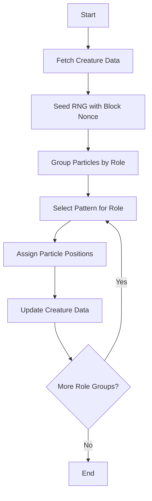
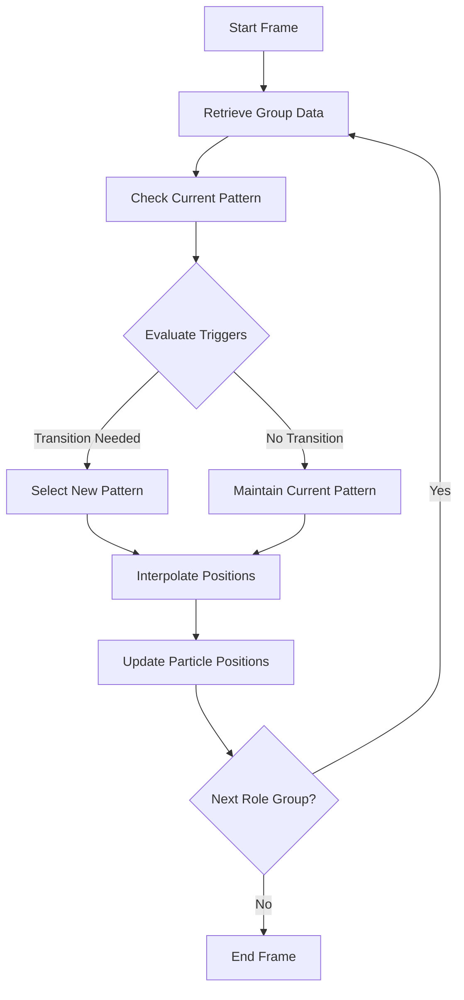
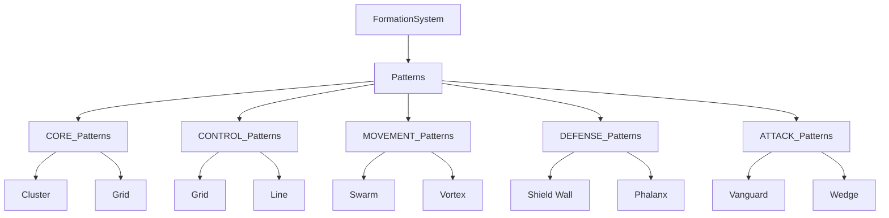
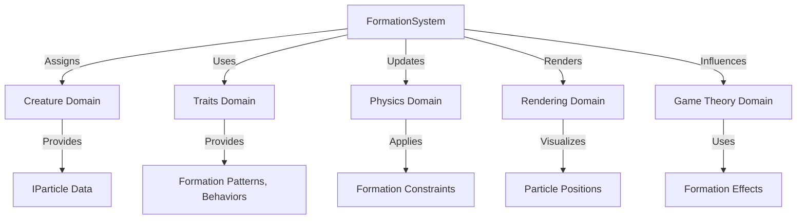

# Formation System Diagrams

## Purpose
This document provides visual aids to illustrate the structure, workflows, and interactions of the formation system in Bitcoin Protozoa, specifically tailored to its particle-based design, role-specific mechanics (CORE, CONTROL, MOVEMENT, DEFENSE, ATTACK), and deterministic RNG driven by Bitcoin block data. It serves as a single source of truth for developers and contributors, enhancing comprehension through graphical representations of formation assignment, dynamic updates, and integrations with other systems, supporting the project’s domain-driven design (DDD) principles.

## Location
`new_docs/systems/formation/formation_diagrams.md`

## Overview
The formation system in Bitcoin Protozoa organizes up to 500 particles per creature into role-specific patterns (e.g., “Shield Wall” for DEFENSE, “Cluster” for CORE), influencing behavior, visuals, physics, and game theory outcomes. Managed by `formationService.ts` in the `traits` domain, the system ensures deterministic assignments and updates using block nonce-seeded RNG. This document includes flowcharts for formation assignment and update workflows, diagrams of pattern hierarchies by role, and visuals of system interactions, using Mermaid syntax for clarity. It facilitates migration from the current GitHub structure (https://github.com/BTCEnoch/Protozoa/tree/main) to the new DDD framework by aligning visualizations with the updated architecture.

## Flowchart: Formation Assignment Workflow
This flowchart illustrates the process of assigning formation patterns to particle groups during creature generation.



- **Description**: The workflow begins by fetching `ICreature` data, including `IParticle[]` with roles. The RNG is seeded with the block nonce from `bitcoinService.ts` for determinism. Particles are grouped by role (e.g., 100 DEFENSE particles), and a pattern (e.g., “Shield Wall”) is selected using `formationService.ts` based on role and RNG. Particle positions are assigned according to the pattern’s coordinates, updating the creature’s data for rendering and physics.

## Flowchart: Formation Update Workflow
This flowchart shows how formations dynamically adjust during gameplay based on conditions.



- **Description**: For each role group, `formationService.ts` retrieves the current `IFormationPattern` and checks gameplay conditions (e.g., enemy proximity < 10 units). If a transition is triggered (e.g., DEFENSE to “Shield Wall”), a new pattern is selected using seeded RNG. Particle positions are interpolated to the new pattern’s coordinates, ensuring smooth transitions, and updated in `IParticle` data for rendering and physics.

## Diagram: Formation Pattern Hierarchy
This diagram illustrates the hierarchy of formation patterns by role.



- **Description**: The formation system branches into role-specific pattern sets, stored in `src/domains/traits/data/formationPatterns/`. Each role (e.g., DEFENSE) has patterns like “Shield Wall” or “Phalanx,” defining unique spatial arrangements and tactical effects (e.g., “Shield Wall” reduces damage by 25%). Patterns are selected based on role and rarity, ensuring role-appropriate tactics.

## Visual: Formation System Interactions
This diagram shows how the formation system interacts with other domains.



- **Description**: The formation system (`formationService.ts`) assigns patterns to particles managed by the `creature` domain (`particleService.ts`). The `traits` domain provides `IFormationPattern` and `IBehavior` data to guide assignments and transitions. The `physics` domain (`forceWorker.ts`) applies formation-constrained forces, while the `rendering` domain (`instancedRenderer.ts`) visualizes particle positions. The `gameTheory` domain (`payoffMatrixService.ts`) uses formation effects (e.g., “Shield Wall” damage reduction) for battle outcomes.

## Why Diagrams Are Important
- **Clarity**: Visuals simplify complex formation workflows, making assignments and updates accessible to developers and designers.
- **Alignment**: Diagrams ensure team members share a unified understanding of formation mechanics and integrations.
- **Scalability**: Graphical representations highlight extension points (e.g., new patterns like “Vortex”), supporting future enhancements.
- **Specificity**: Tailored to Bitcoin Protozoa’s particle-based, deterministic design, ensuring relevance.

## Integration Points
- **Formation Domain (`src/domains/traits/`)**: `formationService.ts` manages pattern assignments and updates.
- **Creature Domain (`src/domains/creature/`)**: Provides `ICreature` and `IParticle` data for position updates.
- **Traits Domain (`src/domains/traits/`)**: Supplies `IFormationPattern` and `IBehavior` for pattern selection and dynamics.
- **Physics Domain (`src/domains/workers/`)**: `forceWorker.ts` and `positionWorker.ts` maintain formation integrity.
- **Rendering Domain (`src/domains/rendering/`)**: `instancedRenderer.ts` visualizes formation positions.
- **Game Theory Domain (`src/domains/gameTheory/`)**: `payoffMatrixService.ts` incorporates formation effects.

## Rules Adherence
- **Determinism**: Diagrams reflect deterministic processes (e.g., RNG-seeded pattern selection).
- **Modularity**: Visuals highlight encapsulated components (e.g., `formationService.ts`).
- **Performance**: Workflows are designed for efficiency, supporting < 5ms updates for 500 particles.

## Migration Steps
To transition from the current GitHub structure (https://github.com/BTCEnoch/Protozoa/tree/main):
1. **Identify Existing Logic**: Locate formation-related code (e.g., in `src/creatures/` or `src/lib/`).
2. **Refactor into New Structure**: Move logic to `src/domains/traits/services/formationService.ts` and update visualizations to reflect new paths.
3. **Update Documentation**: Ensure diagrams use DDD service names (e.g., `formationService.ts`).
4. **Test Visual Consistency**: Validate that visualized workflows match implemented behavior using Jest and visual inspections.

## Example Integration
The formation assignment flowchart is implemented in `formationService.ts`:
```typescript
// src/domains/traits/services/formationService.ts
class FormationService {
  assignFormation(group: IGroup, blockData: IBlockData): void {
    const rng = createRNGFromBlock(blockData.nonce).getStream('formations');
    const pattern = this.selectPattern(group.role, rng);
    this.applyPattern(group.particles, pattern);
    group.currentPattern = pattern;
  }

  private selectPattern(role: Role, rng: () => number): IFormationPattern {
    const patterns = this.getPatternPool(role);
    const rarity = this.determineRarity(rng);
    const filtered = patterns.filter(p => p.rarity === rarity);
    return filtered[Math.floor(rng() * filtered.length)] || patterns[0];
  }
}
```

