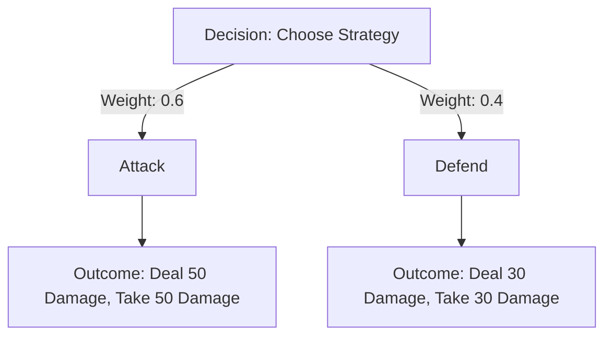

# Decision Tree Processing

## Purpose
This document describes how decision trees are constructed and processed in Bitcoin Protozoa to guide creature behavior and strategic choices during battles and interactions. It serves as a single source of truth for developers, detailing the role of particle roles (CORE, CONTROL, MOVEMENT, DEFENSE, ATTACK) and traits in decision-making, ensuring deterministic and balanced gameplay. The document is specific to the project’s design, leveraging its deterministic RNG and particle-based mechanics.

## Location
`new_docs/systems/game_theory/decision_tree_processing.md`

## Overview
In Bitcoin Protozoa, decision trees model creature behavior by representing possible actions (e.g., attack, defend, retreat) as branches, with outcomes evaluated based on particle roles and traits. Managed by the `decisionTreeService.ts` in the `gameTheory` domain, decision tree processing ensures creatures make strategic choices that reflect their composition and context (e.g., opponent strength, particle health). The process is deterministic, using static creature data and trait effects, ensuring consistent behavior across runs. This document outlines the construction and processing workflow, rules for decision-making, and integration points, facilitating migration from the current GitHub structure (https://github.com/BTCEnoch/Protozoa/tree/main) to the new DDD framework.

## Decision Tree Structure
A decision tree consists of:
- **Nodes**: Decision points (e.g., “Choose strategy”) or outcomes (e.g., “Deal 50 damage”).
- **Branches**: Possible actions or choices (e.g., Attack, Defend, Retreat).
- **Weights**: Probabilities or utility values influenced by particle roles and traits.
- **Outcomes**: Payoff values (e.g., damage dealt, health preserved) based on choices.

### Example Decision Tree
For a creature choosing between Attack and Defend:

- **Interpretation**: The creature is more likely to attack (60% chance) due to a high number of ATTACK particles, but defending preserves more health.

## Construction and Processing Workflow
The decision tree construction and processing workflow involves:

1. **Retrieve Creature Data**:
   - Access `ICreature` and `IParticle[]` data, including roles and traits (abilities, behaviors, mutations).
2. **Define Decision Nodes**:
   - Create a root node representing the current decision (e.g., “Choose battle strategy”).
   - Add child nodes for possible actions (e.g., Attack, Defend).
3. **Assign Weights**:
   - Calculate branch weights based on particle roles (e.g., CONTROL particles boost strategic accuracy) and behavior traits (e.g., “Aggressive” favors Attack).
4. **Evaluate Outcomes**:
   - Use payoff matrices from `payoffMatrixService.ts` to determine outcomes for each branch.
   - Factor in trait effects (e.g., “Fire Blast” ability increases damage).
5. **Select Optimal Path**:
   - Traverse the tree to select the branch with the highest utility, guided by `utilityFunctionService.ts`.
6. **Apply Decision**:
   - Update creature state (e.g., execute Attack strategy, adjust particle positions).

### Rules for Decision-Making
- **Role Contributions**:
  - **CORE**: Increases outcome stability (+0.1% health preservation per particle).
  - **CONTROL**: Boosts decision accuracy (+0.05% weight to optimal branch per particle).
  - **MOVEMENT**: Favors aggressive or evasive actions (+0.1% Attack/Retreat weight per particle).
  - **DEFENSE**: Prioritizes defensive actions (+0.2% Defend weight per particle).
  - **ATTACK**: Favors offensive actions (+0.25% Attack weight per particle).
- **Trait Modifiers**:
  - **Abilities**: Adjust outcome values (e.g., +10 damage for “Fire Blast”).
  - **Behaviors**: Shift branch weights (e.g., “Cautious” increases Defend weight by 10%).
  - **Mutations**: Add dynamic effects (e.g., “Enhanced Reflexes” boosts Retreat weight by 5%).
- **Determinism**: Weights and outcomes are calculated using static data, ensuring identical decisions for the same inputs.

### Example Decision Tree Calculation
For a creature with 100 CONTROL particles and an “Aggressive” behavior:
- **Branch Weights**:
  - Attack: Base 0.5 + (100 * 0.05) + 0.1 (Aggressive) = 0.65
  - Defend: Base 0.5 - 0.1 (Aggressive) = 0.35
- **Outcome**: Attack chosen due to higher weight, dealing increased damage based on payoff matrix.

## Implementation
The `decisionTreeService.ts` service constructs and processes decision trees, integrating with `payoffMatrixService.ts` and `utilityFunctionService.ts` for outcome evaluation.

### Example Implementation
```typescript
// src/domains/gameTheory/services/decisionTreeService.ts
import { Singleton } from 'typescript-singleton';
import { ICreature } from 'src/domains/creature/types/creature';
import { IDecisionTree } from 'src/domains/gameTheory/types/decisionTree';
import { payoffMatrixService } from 'src/domains/gameTheory/services/payoffMatrixService';
import { Role } from 'src/shared/types/core';

class DecisionTreeService extends Singleton {
  processDecision(creature1: ICreature, creature2: ICreature): string {
    const tree = this.constructTree(creature1, creature2);
    const strategy = this.selectOptimalStrategy(tree);
    return strategy;
  }

  private constructTree(creature1: ICreature, creature2: ICreature): IDecisionTree {
    const controlCount = creature1.particles.filter(p => p.role === Role.CONTROL).length;
    const behaviorModifier = creature1.particles.some(p => p.behaviorTrait?.action === 'Aggressive') ? 0.1 : 0;
    const weights = {
      Attack: 0.5 + (controlCount * 0.05) + behaviorModifier,
      Defend: 0.5 - behaviorModifier
    };
    const matrix = payoffMatrixService.generateMatrix(creature1, creature2);
    return {
      root: {
        type: 'decision',
        branches: [
          { strategy: 'Attack', weight: weights.Attack, outcome: matrix.payoffs[0][0] },
          { strategy: 'Defend', weight: weights.Defend, outcome: matrix.payoffs[1][1] }
        ]
      }
    };
  }

  private selectOptimalStrategy(tree: IDecisionTree): string {
    const bestBranch = tree.root.branches.reduce((best, branch) => {
      return branch.weight > best.weight ? branch : best;
    }, tree.root.branches[0]);
    return bestBranch.strategy;
  }
}

export const decisionTreeService = DecisionTreeService.getInstance();
```

## Performance Considerations
To ensure efficient decision tree processing for 500 particles:
1. **Aggregate Particle Data**: Summarize role counts and trait effects at the creature level to reduce iteration complexity.
2. **Cache Decision Trees**: Store trees for common scenarios in `decisionTreeService.ts` to avoid recalculation.
3. **Simplify Trees**: Limit branches to key strategies (e.g., Attack, Defend) to reduce computational load.
4. **Off-Thread Processing**: Use `computeWorker.ts` for complex tree evaluations to offload the main thread.

## Integration Points
- **Game Theory Domain (`src/domains/gameTheory/`)**: `decisionTreeService.ts` integrates with `payoffMatrixService.ts` and `utilityFunctionService.ts` for outcome and utility calculations.
- **Creature Domain (`src/domains/creature/`)**: Provides `ICreature` and `IParticle` data for role and trait inputs.
- **Traits Domain (`src/domains/traits/`)**: Supplies `IBehavior` and `IAbility` traits to adjust weights and outcomes.
- **Workers Domain (`src/domains/workers/`)**: Offloads computations via `computeWorker.ts`.

## Rules Adherence
- **Determinism**: Decisions are based on static creature and trait data, ensuring consistency.
- **Modularity**: Tree processing is encapsulated in `decisionTreeService.ts`, with clear interfaces.
- **Performance**: Targets < 10ms per decision, optimized with caching and off-thread processing.

## Migration Steps
To transition from the current GitHub structure (https://github.com/BTCEnoch/Protozoa/tree/main):
1. **Identify Existing Logic**: Locate decision-making code (e.g., in `src/lib/` or `src/creatures/`).
2. **Refactor into Decision Tree Service**: Move logic to `src/domains/gameTheory/services/decisionTreeService.ts`.
3. **Integrate Particle Data**: Update to use `IParticle` roles and traits for weights and outcomes.
4. **Optimize Performance**: Implement caching and off-thread processing for efficiency.
5. **Test Decisions**: Validate strategic choices using Jest, ensuring correct role and trait influences.

## Example Test
```typescript
// tests/unit/decisionTreeService.test.ts
describe('DecisionTreeService', () => {
  test('selects Attack for CONTROL-heavy creature', () => {
    const blockData = createMockBlockData(12345);
    const creature1 = createMockCreature(blockData, { controlParticles: 100 });
    const creature2 = createMockCreature(blockData);
    const strategy = decisionTreeService.processDecision(creature1, creature2);
    expect(strategy).toBe('Attack'); // CONTROL boosts Attack weight
  });
});
```
