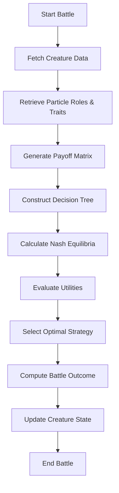
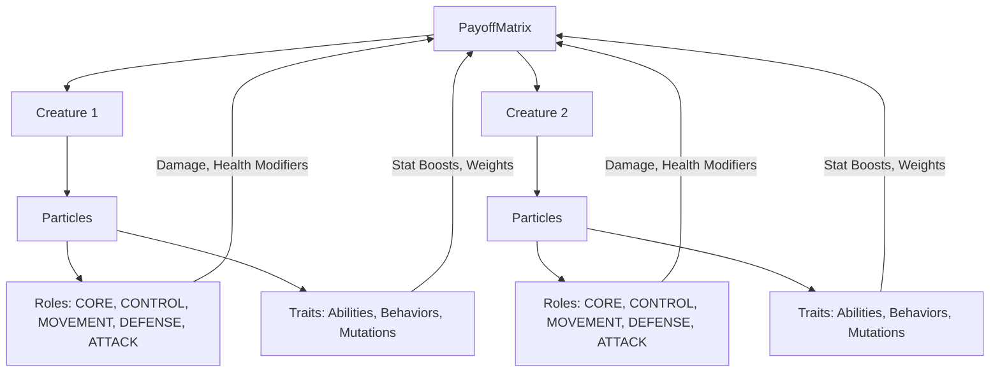
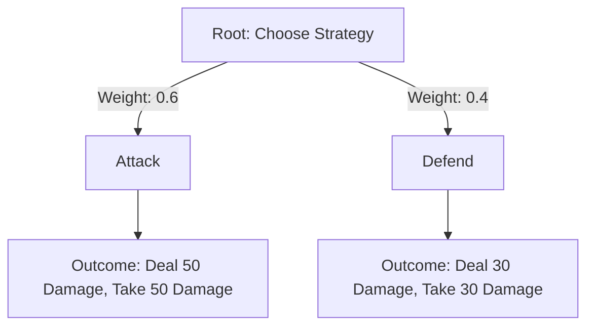
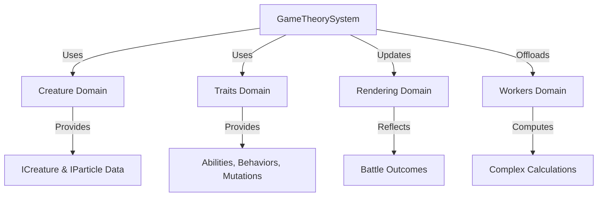

# Game Theory Visualization

## Purpose
This document provides visual aids to illustrate the structure, workflows, and interactions of the game theory system in Bitcoin Protozoa, specifically tailored to its particle-based design, role-specific mechanics (CORE, CONTROL, MOVEMENT, DEFENSE, ATTACK), and deterministic RNG driven by Bitcoin block data. It serves as a single source of truth for developers and contributors, enhancing comprehension through graphical representations of payoff matrices, decision trees, and system integrations, supporting the project’s domain-driven design (DDD) principles.

## Location
`new_docs/systems/game_theory/game_theory_visualization.md`

## Overview
The game theory system in Bitcoin Protozoa drives strategic interactions, such as battles, by modeling creature behaviors and outcomes using payoff matrices, decision trees, Nash equilibria, and utility functions. These mechanics rely on particle roles and traits to determine payoffs and decisions, with deterministic calculations tied to block nonce. This document includes flowcharts for battle simulation workflows, diagrams of payoff matrix construction, and visuals of decision tree processing, using Mermaid syntax for clarity. It facilitates migration from the current GitHub structure (https://github.com/BTCEnoch/Protozoa/tree/main) to the new DDD framework by aligning visualizations with the updated architecture.

## Flowchart: Battle Simulation Workflow
This flowchart illustrates the process of simulating a battle between two creatures, highlighting the integration of particle roles and traits.



- **Description**: The workflow begins by fetching `ICreature` data, including `IParticle[]` with roles and traits. The `payoffMatrixService.ts` generates a matrix based on role contributions (e.g., ATTACK particles increase damage) and trait effects (e.g., “Fire Blast” adds +10 damage). The `decisionTreeService.ts` constructs a tree with strategy branches (e.g., Attack, Defend), weighted by CONTROL particles and behaviors. The `nashEquilibriumFinder.ts` identifies stable strategies, and `utilityFunctionService.ts` evaluates utilities to select the optimal strategy. The `gameTheoryStrategyService.ts` computes the outcome, updating creature states (e.g., health).

## Diagram: Payoff Matrix Construction
This diagram shows how particle roles and traits contribute to constructing a payoff matrix.



- **Description**: The payoff matrix is constructed by aggregating contributions from each creature’s particles. Roles (e.g., ATTACK: +0.25% damage per particle) and traits (e.g., “Fire Blast” adds +10 damage) modify payoff values, stored as `number[][]` in `payoffMatrixService.ts`. The matrix represents outcomes for strategy combinations (e.g., Attack vs. Defend).

## Visual: Decision Tree Processing
This visual illustrates the decision tree structure and processing for a creature’s strategic choice.



- **Description**: The decision tree’s root node represents the creature’s choice, with branches for strategies (Attack, Defend). Weights are influenced by CONTROL particles (+0.05% per particle) and behavior traits (e.g., “Aggressive” adds +10% to Attack). Outcomes are derived from the payoff matrix, and the `decisionTreeService.ts` selects the highest-weighted branch, ensuring deterministic choices based on static data.

## Visual: System Interactions
This diagram shows how the game theory system interacts with other domains.



- **Description**: The game theory system (`gameTheoryStrategyService.ts`) uses `ICreature` and `IParticle` data from the `creature` domain for role and trait inputs. The `traits` domain (`traitService.ts`) provides `IAbility`, `IBehavior`, and `IMutation` data to modify payoffs and weights. Battle outcomes update creature states, reflected in visuals via the `rendering` domain (`instancedRenderer.ts`). Complex calculations are offloaded to the `workers` domain (`computeWorker.ts`).

## Why Visualizations Are Important
- **Clarity**: Diagrams simplify complex game theory workflows, making them accessible to developers and designers.
- **Alignment**: Visuals ensure team members share a unified understanding of strategic mechanics and integrations.
- **Scalability**: Graphical representations highlight extension points (e.g., new strategies), supporting future enhancements.
- **Specificity**: Tailored to Bitcoin Protozoa’s particle-based, deterministic design, ensuring relevance.

## Integration Points
- **Game Theory Domain (`src/domains/gameTheory/`)**: Visualizations reflect workflows in `payoffMatrixService.ts`, `decisionTreeService.ts`, `nashEquilibriumFinder.ts`, and `utilityFunctionService.ts`.
- **Creature Domain (`src/domains/creature/`)**: Provides `ICreature` and `IParticle` data for role and trait inputs.
- **Traits Domain (`src/domains/traits/`)**: Supplies `IAbility`, `IBehavior`, and `IMutation` traits for payoff and decision calculations.
- **Rendering Domain (`src/domains/rendering/`)**: Reflects battle outcomes in visuals via `instancedRenderer.ts`.
- **Workers Domain (`src/domains/workers/`)**: Offloads computations via `computeWorker.ts`.

## Rules Adherence
- **Determinism**: Visualizations depict deterministic processes (e.g., RNG-seeded trait effects).
- **Modularity**: Diagrams highlight encapsulated components (e.g., `payoffMatrixService.ts`).
- **Performance**: Workflows are designed for efficiency, supporting < 10ms calculations for 500 particles.

## Migration Steps
To transition from the current GitHub structure (https://github.com/BTCEnoch/Protozoa/tree/main):
1. **Identify Existing Logic**: Locate game theory code (e.g., in `src/lib/` or `src/creatures/`) related to battles and decisions.
2. **Refactor into New Structure**: Move logic to `src/domains/gameTheory/services/` and update visualizations to reflect new paths.
3. **Update Documentation**: Ensure diagrams use DDD service names (e.g., `gameTheoryStrategyService.ts`).
4. **Test Visual Consistency**: Validate that visualized workflows match implemented behavior using Jest and visual inspections.

## Example Integration
The battle simulation flowchart is implemented in `gameTheoryStrategyService.ts`:
```typescript
// src/domains/gameTheory/services/gameTheoryStrategyService.ts
class GameTheoryStrategyService {
  simulateBattle(creature1: ICreature, creature2: ICreature): IBattleOutcome {
    const matrix = payoffMatrixService.generateMatrix(creature1, creature2);
    const tree = decisionTreeService.constructTree(creature1, creature2);
    const equilibria = nashEquilibriumFinder.findEquilibria(matrix);
    const strategy = decisionTreeService.selectOptimalStrategy(tree);
    const outcome = this.computeOutcome(matrix, strategy);
    return { winner: outcome.winner, scores: outcome.scores };
  }
}
```


