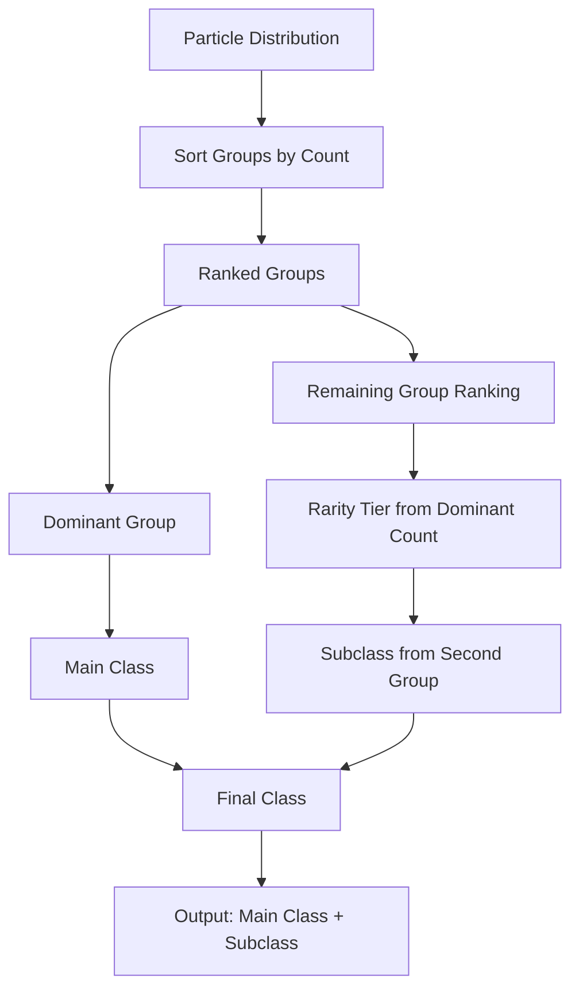

# `05_class_assignment.md`

## Class Assignment

In the Bitcoin Protozoa project, the **Class Assignment** process determines the main class and subclass of each creature based on the particle distribution across its five groups: **CORE**, **CONTROL**, **MOVEMENT**, **DEFENSE**, and **ATTACK**. This document outlines the methodology, leveraging particle counts and group rankings to assign classes, ensuring each creature has a distinct gameplay role tied to its structure and Bitcoin-driven randomness.

### Purpose

The Class Assignment system translates raw particle data into meaningful gameplay identities, such as Healers, Tanks, or Strikers. It drives creature diversity and strategic depth by:
- Assigning a **main class** based on the dominant group (highest particle count).
- Determining a **subclass** influenced by rarity tiers and the ranking of remaining groups.
- Integrating with the Traits Domain for abilities and behaviors, enhancing visual and functional uniqueness.

This process ensures that each of the 500 particles per creature, distributed across five groups, contributes to a cohesive and dynamic role within the simulation.

### Prerequisites

- **Particle Distribution**: Each creature has 500 particles allocated to five groups, with a minimum of 43 particles per group and a maximum of 220, as detailed in `04_particle_distribution.md`.
- **Role System**: Groups are aligned with roles (CORE, CONTROL, MOVEMENT, DEFENSE, ATTACK) per `03_role_system.md`.
- **Bitcoin RNG**: Particle counts are seeded by Bitcoin blockchain data (e.g., nonce) for deterministic randomness, per `06_bitcoin_onchain_resources.md`.

### Main Class Determination

The **main class** is assigned based on the group with the highest particle count, reflecting its dominant role in the creature’s functionality. The mapping is as follows:

| Dominant Group | Main Class | Primary Focus           |
|----------------|------------|-------------------------|
| **CORE**       | Healer     | Restoration and support |
| **CONTROL**    | Caster     | Utility and crowd control |
| **ATTACK**     | Striker    | Damage and offense      |
| **DEFENSE**    | Tank       | Protection and durability |
| **MOVEMENT**   | Rogue      | Speed and evasion       |

#### Rules
- If two or more groups tie for the highest count, the main class is determined by a predefined priority order: CORE > DEFENSE > ATTACK > CONTROL > MOVEMENT.
- The dominant group must have at least 43 particles (guaranteed by the distribution system), but a threshold of 130+ particles indicates a strong specialization, aligning with the class system in `03_role_distribution_analysis.md`.

#### Example
- **Particle Counts**: CORE: 150, DEFENSE: 120, ATTACK: 100, MOVEMENT: 80, CONTROL: 50
- **Main Class**: Healer (CORE has the highest count at 150).

### Subclass Determination

The **subclass** refines the main class by considering the creature’s rarity tier (based on the dominant group’s particle count) and the ranking of the remaining four groups. This process adds nuance to gameplay, allowing for diverse subtypes like “Guardian Healer” or “Swift Striker.”

#### Rarity Tiers
Particle counts determine the rarity tier of the dominant group, influencing subclass potency:

| Rarity     | Particle Range | Description                   |
|------------|----------------|-------------------------------|
| Common     | 43–95          | Basic subclass functionality  |
| Uncommon   | 96–110         | Moderate enhancements         |
| Rare       | 111–125        | Notable ability upgrades      |
| Epic       | 126–141        | Significant power increases   |
| Legendary  | 142–151        | Rare and powerful effects     |
| Mythic     | 152–220        | Exceptional, game-changing traits |

#### Subclass Assignment Process
1. **Rank Groups**: Sort all five groups by particle count in descending order.
2. **Identify Main Class**: The highest-ranked group sets the main class.
3. **Determine Rarity**: The dominant group’s particle count sets the rarity tier.
4. **Assign Subclass**: The second-highest group influences the subclass name, with additional flavor from the full ranking. Each main class has a pool of 15 subclasses spread across rarity tiers (per `11_class_system_implementation.md`).

#### Subclass Naming Convention
- The subclass prefix is derived from the second-highest group:
  - **CORE**: Vital
  - **CONTROL**: Arcane
  - **ATTACK**: Battle
  - **DEFENSE**: Guardian
  - **MOVEMENT**: Swift
- The full subclass may incorporate traits from the third, fourth, and fifth groups for uniqueness.

#### Example
- **Particle Counts**: CORE: 150, DEFENSE: 120, ATTACK: 100, MOVEMENT: 80, CONTROL: 50
- **Ranking**: CORE > DEFENSE > ATTACK > MOVEMENT > CONTROL
- **Main Class**: Healer (CORE)
- **Rarity**: Legendary (150 particles in CORE)
- **Subclass**: Guardian Healer (DEFENSE second), with potential modifiers like “Battle Precision” (ATTACK third) or “Swift Support” (MOVEMENT fourth).

### Diagram: Class Assignment Flow



- **Input**: Particle counts (e.g., CORE: 150, DEFENSE: 120, etc.).
- **Output**: “Legendary Guardian Healer with Battle Precision”.

### Implementation

Below is a TypeScript function to automate class assignment, integrating with the RNG Domain for deterministic outcomes:

```typescript
interface Group {
  role: 'CORE' | 'CONTROL' | 'MOVEMENT' | 'DEFENSE' | 'ATTACK';
  particleCount: number;
}

function assignClass(groups: Group[], seed: number): { mainClass: string; subclass: string; rarity: string } {
  // Sort groups by particle count (descending)
  const rankedGroups = [...groups].sort((a, b) => b.particleCount - a.particleCount);

  // Main class mapping
  const mainClassMap: Record<string, string> = {
    CORE: 'Healer',
    CONTROL: 'Caster',
    ATTACK: 'Striker',
    DEFENSE: 'Tank',
    MOVEMENT: 'Rogue'
  };
  const dominantRole = rankedGroups[0].role;
  const mainClass = mainClassMap[dominantRole];

  // Rarity tier determination
  const particleCount = rankedGroups[0].particleCount;
  const rarityMap = [
    { tier: 'Common', min: 43, max: 95 },
    { tier: 'Uncommon', min: 96, max: 110 },
    { tier: 'Rare', min: 111, max: 125 },
    { tier: 'Epic', min: 126, max: 141 },
    { tier: 'Legendary', min: 142, max: 151 },
    { tier: 'Mythic', min: 152, max: 220 }
  ];
  const rarity = rarityMap.find(r => particleCount >= r.min && particleCount <= r.max)?.tier || 'Common';

  // Subclass prefix from second-highest group
  const subclassPrefixMap: Record<string, string> = {
    CORE: 'Vital',
    CONTROL: 'Arcane',
    ATTACK: 'Battle',
    DEFENSE: 'Guardian',
    MOVEMENT: 'Swift'
  };
  const secondRole = rankedGroups[1].role;
  const subclass = `${subclassPrefixMap[secondRole]} ${mainClass}`;

  return { mainClass, subclass, rarity };
}

// Example usage
const groups: Group[] = [
  { role: 'CORE', particleCount: 150 },
  { role: 'DEFENSE', particleCount: 120 },
  { role: 'ATTACK', particleCount: 100 },
  { role: 'MOVEMENT', particleCount: 80 },
  { role: 'CONTROL', particleCount: 50 }
];
const result = assignClass(groups, 12345); // Seed from Bitcoin nonce
console.log(result); // { mainClass: 'Healer', subclass: 'Guardian Healer', rarity: 'Legendary' }
```

### Integration with Other Systems

- **Particle Distribution (`04_particle_distribution.md`)**: Provides the raw particle counts used for ranking and class assignment.
- **Abilities (`09_abilities.md`)**: Base abilities (e.g., Heal for Healer) are assigned post-classification, modified by subclass.
- **Traits (`10_traits.md`)**: Subclass and rarity influence trait selection (e.g., “Reactive Armor” for Guardian Tanks).
- **RNG Domain**: Uses Bitcoin nonce for deterministic subclass pool selection, ensuring reproducibility tied to blockchain data.

### Test Cases

1. **Balanced Distribution**:
   - Input: CORE: 100, CONTROL: 100, ATTACK: 100, DEFENSE: 100, MOVEMENT: 100
   - Expected: Main Class: Healer (CORE priority), Subclass: Guardian Healer (DEFENSE second), Rarity: Uncommon
2. **Specialized Creature**:
   - Input: ATTACK: 220, CORE: 70, CONTROL: 70, DEFENSE: 70, MOVEMENT: 70
   - Expected: Main Class: Striker, Subclass: Vital Striker, Rarity: Mythic
3. **Tie Scenario**:
   - Input: CORE: 130, DEFENSE: 130, ATTACK: 80, CONTROL: 80, MOVEMENT: 80
   - Expected: Main Class: Healer (CORE priority), Subclass: Guardian Healer, Rarity: Epic

### Future Considerations

- **Hybrid Classes**: Expand to support dual-dominant groups (e.g., Striker-Rogue for ATTACK and MOVEMENT both > 130).
- **Dynamic Subclasses**: Allow subclass evolution based on generational changes from the Evolution Domain.
- **Visual Feedback**: Integrate with the Rendering Domain to reflect class visually (e.g., spiky ATTACK formations for Strikers).

### Conclusion

The Class Assignment process is a cornerstone of the Group Domain, transforming particle distributions into rich, playable roles. By anchoring main classes to dominant groups and subclasses to rarity and rankings, it ensures every creature in Bitcoin Protozoa is unique, balanced, and tied to the blockchain’s deterministic chaos.

---

This document fulfills item #5 of the Group Domain directory, providing a clear, detailed, and actionable guide for assigning classes in the Bitcoin Protozoa project. It integrates seamlessly with the existing documentation and systems, using markdown for readability and including practical examples and code.
