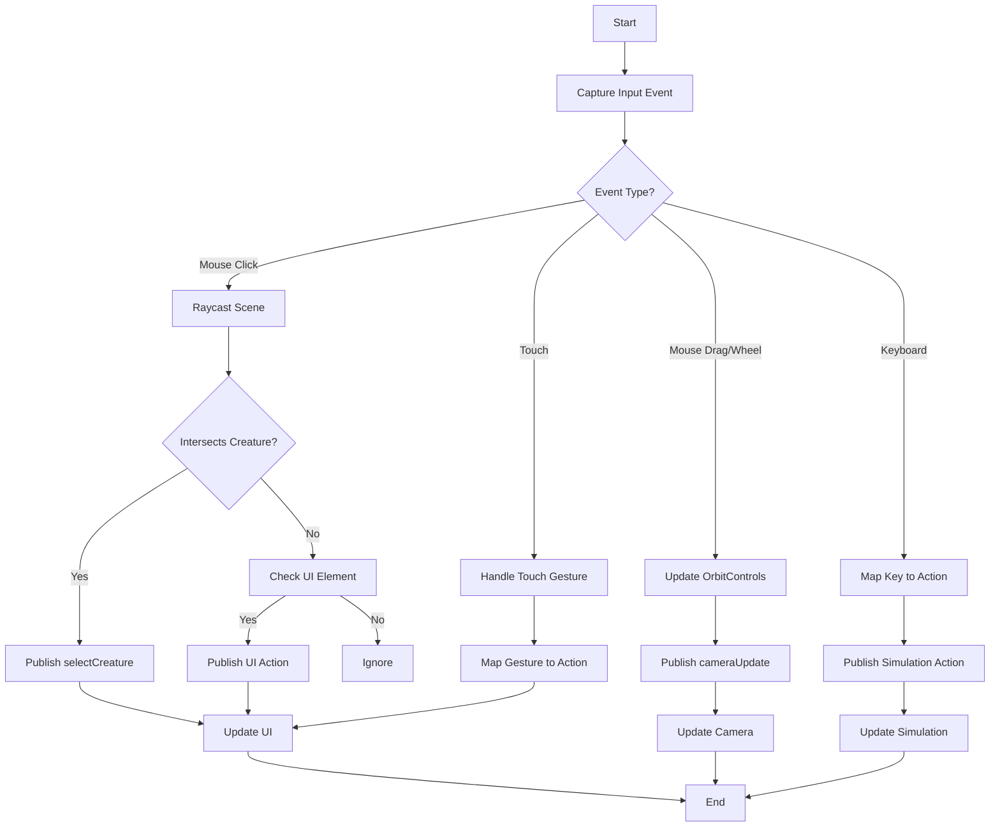
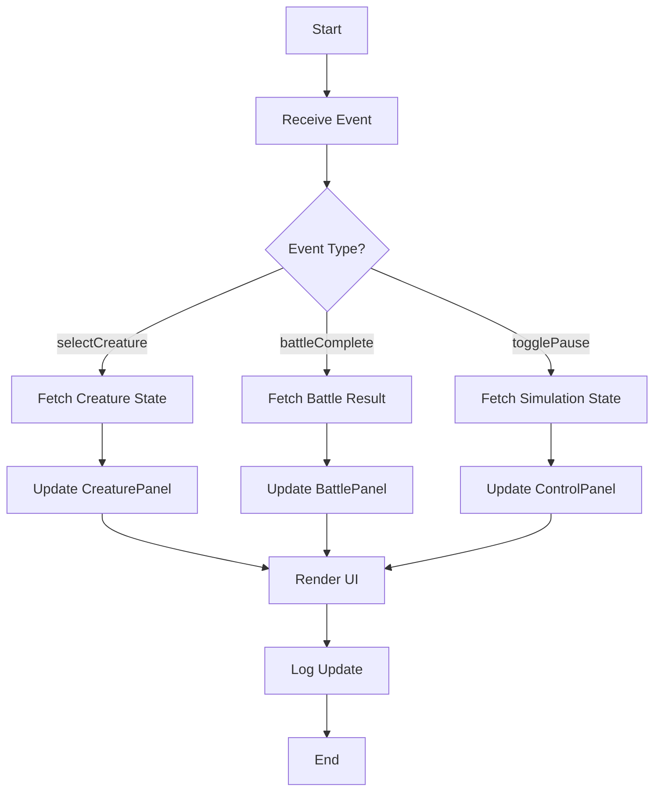
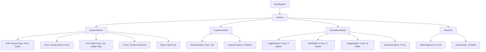
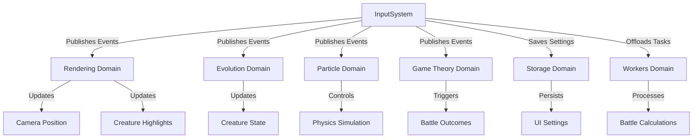

# Input System Diagrams

## Purpose
This document provides visual aids to illustrate the structure, workflows, and interactions of the input system in Bitcoin Protozoa, which manages user interactions such as camera controls, creature selection, and simulation commands. It serves as a single source of truth for developers, tailored to the project’s particle-based design with role-specific mechanics (CORE, CONTROL, MOVEMENT, DEFENSE, ATTACK), deterministic RNG driven by Bitcoin block data, and new DDD framework, ensuring clarity during migration from the current GitHub structure (https://github.com/BTCEnoch/Protozoa/tree/main).

## Location
`new_docs/systems/input/input_diagrams.md`

## Overview
The input system enables users to navigate and control Bitcoin Protozoa’s 3D simulation, processing mouse, keyboard, and touch inputs to drive actions like camera manipulation, creature selection, and battle triggers. Implemented in `inputService.ts` and `uiService.ts` within the `input` domain, it integrates with rendering (`instancedRenderer.ts`), evolution (`evolutionTracker.ts`), physics (`particleService.ts`), and game theory (`payoffMatrixService.ts`), ensuring deterministic responses and performance (< 1ms event handling, < 5ms UI updates, 60 FPS) [Timestamp: April 14, 2025, 19:58]. This document includes flowcharts for event handling and UI update workflows, diagrams of input action hierarchies, and visuals of system interactions, using Mermaid syntax for clarity. It builds on our discussions about user interaction, performance optimization, and modularity [Timestamp: April 12, 2025, 12:18; April 15, 2025, 21:23].

## Flowchart: Event Handling Workflow
This flowchart illustrates the process of capturing and processing user input events.



- **Description**: The workflow begins when `inputService.ts` captures a user input event (e.g., mouse click, key press, touch gesture) using browser APIs. Mouse clicks trigger raycasting to detect creatures or UI elements, publishing `selectCreature` or UI actions. Mouse drags and wheel events update `OrbitControls`, publishing `cameraUpdate`. Keyboard inputs map to simulation actions (e.g., `togglePause`), and touch gestures handle selections or camera movements. Actions are published via `eventBus.ts`, updating the UI (`uiService.ts`), camera (`cameraService.ts`), or simulation state (`particleService.ts`, `gameTheoryStrategyService.ts`), ensuring responsive feedback.

## Flowchart: UI Update Workflow
This flowchart shows how the display UI responds to input-driven events.



- **Description**: The workflow starts when `uiService.ts` receives an event from `eventBus.ts` (e.g., `selectCreature`, `battleComplete`). For `selectCreature`, it fetches creature state from `evolutionStore.ts` to update the `CreaturePanel`. For `battleComplete`, it fetches battle results to update the `BattlePanel`. For `togglePause`, it updates the `ControlPanel` with simulation state. React components are re-rendered efficiently using memoization, and updates are logged, ensuring the UI reflects input-driven changes within 5ms [Timestamp: April 14, 2025, 19:58].

## Diagram: Input Action Hierarchy
This diagram illustrates the hierarchy of input actions triggered by user interactions.



- **Description**: The input system branches into four action categories: Camera, Creature, Simulation, and UI. Camera actions (e.g., Orbit, Zoom) control the Three.js view. Creature actions (e.g., SelectCreature) manage creature interactions. Simulation actions (e.g., TogglePause, StartBattle) control gameplay mechanics. UI actions (e.g., SelectOpponent) handle display interactions. Each action is triggered by specific inputs (e.g., mouse, keyboard, touch, UI), ensuring comprehensive user control [Timestamp: April 15, 2025, 21:23].

## Visual: Input System Interactions
This diagram shows how the input system interacts with other domains.



- **Description**: The input system (`inputService.ts`, `uiService.ts`) publishes events via `eventBus.ts` to update the rendering domain (`cameraService.ts`, `instancedRenderer.ts`) for camera and visual changes, the evolution domain (`evolutionTracker.ts`) for creature state updates, the particle domain (`particleService.ts`) for physics control, and the game theory domain (`payoffMatrixService.ts`) for battle triggers. The storage domain (`StorageService.ts`) persists UI settings [Timestamp: April 16, 2025, 21:41], and the workers domain (`computeWorker.ts`) offloads complex calculations [Timestamp: April 14, 2025, 19:58].

## Why Diagrams Are Important
- **Clarity**: Visuals simplify complex input workflows, making event handling and UI updates accessible [Timestamp: April 15, 2025, 21:23].
- **Alignment**: Diagrams ensure team members share a unified understanding of input interactions and action mappings.
- **Scalability**: Highlight extension points (e.g., new input types, UI components), supporting future enhancements.
- **Specificity**: Tailored to Bitcoin Protozoa’s deterministic, performance-driven design [Timestamp: April 12, 2025, 12:18].

## Integration Points
- **Input Domain (`src/domains/input/`)**: `inputService.ts` processes events, and `uiService.ts` manages UI rendering.
- **Rendering Domain (`src/domains/rendering/`)**: `instancedRenderer.ts` and `cameraService.ts` handle visual updates.
- **Evolution Domain (`src/domains/evolution/`)**: `evolutionTracker.ts` responds to creature selections.
- **Particle Domain (`src/domains/creature/`)**: `particleService.ts` adjusts physics for simulation commands.
- **Game Theory Domain (`src/domains/gameTheory/`)**: `payoffMatrixService.ts` processes battle triggers.
- **Storage Domain (`src/shared/services/`)**: `StorageService.ts` persists UI settings [Timestamp: April 16, 2025, 21:41].
- **Workers Domain (`src/domains/workers/`)**: `computeWorker.ts` offloads input-driven calculations [Timestamp: April 14, 2025, 19:58].

## Rules Adherence
- **Determinism**: Diagrams reflect deterministic event handling with static mappings [Timestamp: April 12, 2025, 12:18].
- **Modularity**: Visuals highlight encapsulated components (e.g., `inputService.ts`, `uiService.ts`) [Timestamp: April 15, 2025, 21:23].
- **Performance**: Workflows are optimized for < 1ms event handling, < 5ms UI updates, and 60 FPS [Timestamp: April 14, 2025, 19:58].

## Migration Steps
To transition from the current GitHub structure (https://github.com/BTCEnoch/Protozoa/tree/main):
1. **Identify Existing Logic**: Locate input-related code (e.g., in `src/creatures/` or `src/lib/`), likely minimal.
2. **Refactor into Input Domain**: Move logic to `src/domains/input/` and update diagrams to reflect DDD paths.
3. **Update Documentation**: Ensure diagrams reference new service names (e.g., `inputService.ts`, `uiService.ts`).
4. **Test Visual Consistency**: Validate workflows match implemented behavior using Jest and visual inspections.

## Example Integration
The event handling workflow is implemented in `inputService.ts`:
```typescript
// src/domains/input/services/inputService.ts
class InputService extends Singleton {
  private handleClick(event: MouseEvent) {
    this.mouse.set(
      (event.clientX / window.innerWidth) * 2 - 1,
      -(event.clientY / window.innerHeight) * 2 + 1
    );
    this.raycaster.setFromCamera(this.mouse, cameraService.getCamera());
    const intersects = this.raycaster.intersectObjects(sceneManager.getScene().children);
    if (intersects.length > 0) {
      const creatureId = intersects[0].object.userData.creatureId;
      eventBus.publish({ type: 'selectCreature', payload: { creatureId } });
      logger.debug(`Selected creature ${creatureId}`);
    }
  }
}
```


