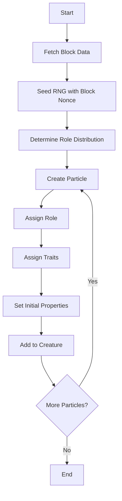
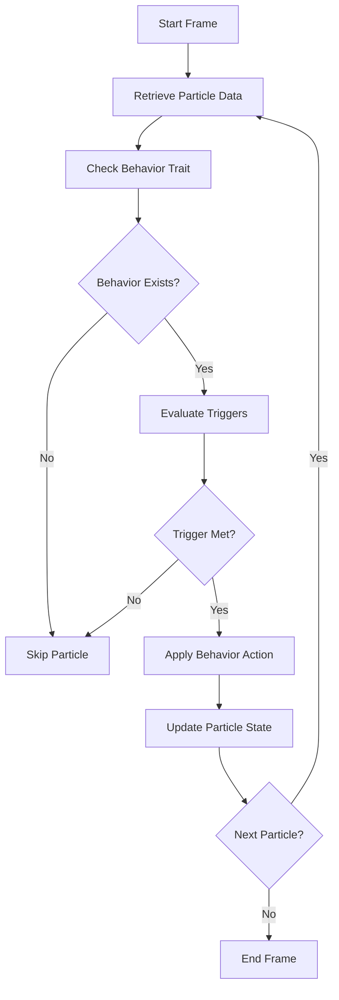
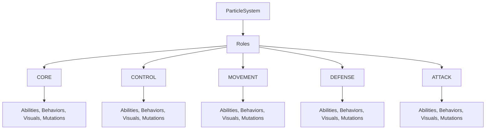
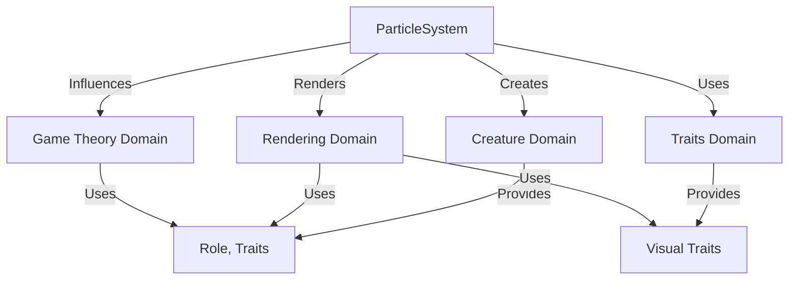

# Particle System Diagrams

## Purpose
This document provides visual aids to illustrate the structure, workflows, and interactions of the particle system in Bitcoin Protozoa. It serves as a single source of truth for developers and contributors, enhancing comprehension through graphical representations of particle creation, behavior, and integration with other systems. The diagrams align with the project’s domain-driven design (DDD) principles and support the migration from the current GitHub structure (https://github.com/BTCEnoch/Protozoa/tree/main) to the new framework.

## Location
`new_docs/systems/particle/particle_diagrams.md`

## Overview
The particle system in Bitcoin Protozoa manages up to 500 particles per creature, each with a role (CORE, CONTROL, MOVEMENT, DEFENSE, ATTACK) and traits that define their behavior, appearance, and interactions. The system integrates with the `creature`, `traits`, `rendering`, and `gameTheory` domains, relying on deterministic processes driven by Bitcoin block data. This document includes flowcharts for particle creation and behavior workflows, diagrams of role hierarchies, and visuals of system interactions, using Mermaid syntax for clarity.

## Flowchart: Particle Creation Workflow
This flowchart illustrates the process of creating and initializing particles for a creature, highlighting deterministic role and trait assignment.



- **Description**: The workflow begins by fetching block data (`IBlockData`) to seed the RNG with the block nonce, ensuring determinism. Roles are assigned based on predefined ratios (e.g., 20% CORE), and traits (e.g., visual, behavior) are applied using the seeded RNG. Each particle is initialized with properties like position and scale, then added to the creature’s `IParticle[]` array.

## Flowchart: Particle Behavior Workflow
This flowchart shows how particle behaviors are applied, focusing on role-specific dynamics and trigger conditions.



- **Description**: For each particle, the system checks for a behavior trait (`IBehavior`). If present, it evaluates trigger conditions (e.g., proximity to other particles). If a trigger is met, the behavior’s action (e.g., flocking) is applied, updating the particle’s state (e.g., position, velocity). This process repeats for all particles in the frame.

## Diagram: Particle Role Hierarchy
This diagram illustrates the hierarchy of particle roles and their associated traits.



- **Description**: The particle system branches into five roles, each linked to role-specific trait pools (e.g., `abilityPools/core.ts`). Traits define the particle’s behavior, appearance, and interactions, ensuring role-specific functionality (e.g., CORE stabilizes, ATTACK engages enemies).

## Visual: Particle System Interactions
This diagram shows how the particle system interacts with other domains.



- **Description**: The particle system creates particles managed by the `creature` domain (`particleService.ts`). It uses traits from the `traits` domain (`traitService.ts`) to define behaviors and visuals. The `rendering` domain (`instancedRenderer.ts`) visualizes particles, while the `gameTheory` domain (`gameTheoryStrategyService.ts`) uses particle roles and traits for battle outcomes and strategic decisions.

## Why Diagrams Are Important
- **Clarity**: Visuals simplify complex workflows, making particle creation and behavior easier to understand.
- **Alignment**: Diagrams ensure all team members share a unified view of the particle system’s structure and interactions.
- **Scalability**: Graphical representations highlight extension points (e.g., new roles), supporting future enhancements.

## Integration Points
- **Creature Domain (`src/domains/creature/`)**: `particleService.ts` manages particle creation and state updates.
- **Traits Domain (`src/domains/traits/`)**: `traitService.ts` provides trait data for role-specific behaviors and visuals.
- **Rendering Domain (`src/domains/rendering/`)**: `instancedRenderer.ts` renders particle visuals.
- **Game Theory Domain (`src/domains/gameTheory/`)**: `gameTheoryStrategyService.ts` uses particle data for strategic calculations.

## Rules Adherence
- **Determinism**: Diagrams reflect deterministic processes (e.g., RNG-seeded role assignment).
- **Modularity**: Visuals highlight encapsulated components (e.g., `particleService.ts`, `behaviorService.ts`).
- **Performance**: Workflows are designed for efficiency, supporting < 10ms updates for 500 particles.

## Migration Steps
To transition from the current GitHub structure (https://github.com/BTCEnoch/Protozoa/tree/main):
1. **Identify Existing Logic**: Locate particle-related code (e.g., in `src/creatures/`, `src/lib/`).
2. **Refactor into New Structure**: Move logic to `src/domains/creature/services/particleService.ts` and related services.
3. **Update Documentation**: Ensure diagrams reflect the new DDD structure, updating paths and service names.
4. **Test Visual Consistency**: Validate that particle creation, behaviors, and visuals match expected outcomes using Jest and visual inspections.

## Example Integration
The particle creation flowchart is implemented in `particleService.ts`:
```typescript
// src/domains/creature/services/particleService.ts
class ParticleService {
  createParticles(count: number, blockData: IBlockData): IParticle[] {
    const rng = createRNGFromBlock(blockData.nonce).getStream('particles');
    const particles = [];
    for (let i = 0; i < count; i++) {
      const role = this.assignRole(rng);
      const particle = {
        id: `particle-${i}`,
        role,
        position: [0, 0, 0],
        velocity: [0, 0, 0],
        visualTrait: traitService.assignTrait({ id: `particle-${i}`, role }, blockData, 'visual')
      };
      particles.push(particle);
    }
    return particles;
  }
}
```

This document enhances understanding of the particle system in Bitcoin Protozoa through clear, structured visual aids, supporting development and collaboration.

Are you ready for the next document (particle_diagrams.md)?
