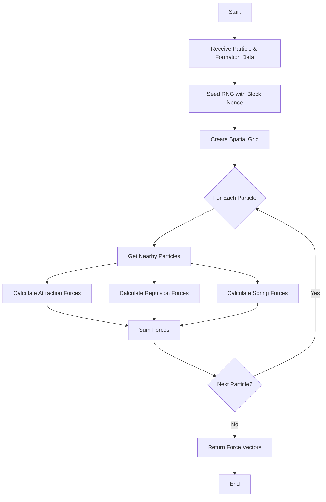
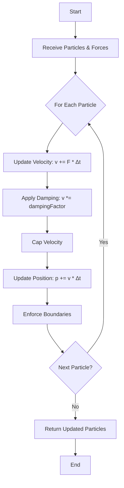
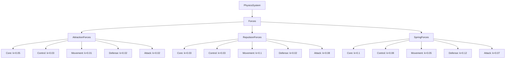
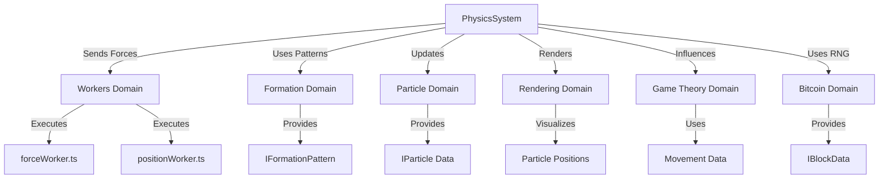

# Physics System Diagrams

## Purpose
This document provides visual aids to illustrate the structure, workflows, and interactions of the physics system in Bitcoin Protozoa, focusing on force calculations and position updates for up to 500 particles per creature. It serves as a single source of truth for developers, tailored to the project’s particle-based design with role-specific mechanics (CORE, CONTROL, MOVEMENT, DEFENSE, ATTACK), deterministic RNG driven by Bitcoin block data, and new DDD framework, ensuring clarity during migration from the current GitHub structure (https://github.com/BTCEnoch/Protozoa/tree/main).

## Location
`new_docs/systems/physics/physics_diagrams.md`

## Overview
The physics system drives particle dynamics in Bitcoin Protozoa, enabling realistic movement and adherence to role-specific formations (e.g., “Shield Wall” for DEFENSE, “Spiral Charge” for ATTACK) [Timestamp: April 8, 2025, 19:50]. Implemented in `forceWorker.ts` and `positionWorker.ts` within the `workers` domain, it ensures deterministic, performant updates (< 5ms, 60 FPS) [Timestamp: April 14, 2025, 19:58] and integrates with formations (`formationService.ts`), rendering (`instancedRenderer.ts`), and game theory (`payoffMatrixService.ts`). This document includes flowcharts for force calculation and position update workflows, diagrams of force type hierarchies, and visuals of system interactions, using Mermaid syntax for clarity. It builds on our discussions about physics, formations, and modularity [Timestamp: April 12, 2025, 12:18; April 15, 2025, 21:23].

## Flowchart: Force Calculation Workflow
This flowchart illustrates the process of calculating forces (attraction, repulsion, spring) for particles.



- **Description**: The workflow begins by receiving `IParticle[]` and `IFormationPattern[]` data from `particleService.ts` via `workerBridge.ts`. The RNG is seeded with the block nonce for deterministic dynamic forces (if needed) [Timestamp: April 12, 2025, 12:18]. `spatialUtils.ts` creates a spatial grid to identify nearby particles, reducing complexity to O(n) [Timestamp: April 14, 2025, 19:58]. For each particle, attraction, repulsion, and spring forces are calculated based on role-specific constants (e.g., `k_spring = 0.12` for DEFENSE), summed into a net force vector, and returned as a `Float32Array` to `positionWorker.ts`.

## Flowchart: Position Update Workflow
This flowchart shows how forces are applied to update particle positions and velocities.



- **Description**: `positionWorker.ts` receives `IParticle[]` and force vectors from `forceWorker.ts` via `workerBridge.ts`. For each particle, Euler integration updates velocity (`v += F * Δt`), applies role-specific damping (e.g., 0.94 for DEFENSE), caps velocity (e.g., 5 units/s for MOVEMENT), and updates position (`p += v * Δt`). Boundaries (e.g., 100-unit cube) are enforced to maintain stability. Updated particles are returned to `particleService.ts` for rendering and game theory integration.

## Diagram: Force Type Hierarchy
This diagram illustrates the hierarchy of force types used in the physics system.



- **Description**: The physics system branches into three force types: attraction, repulsion, and spring forces, each with role-specific constants (k). Attraction forces maintain cohesion (highest for CORE), repulsion forces prevent overlap (highest for MOVEMENT), and spring forces enforce formation alignment (highest for DEFENSE). Constants are tuned to reflect tactical roles, ensuring formations like “Spiral Charge” or “Shield Wall” behave appropriately [Timestamp: April 8, 2025, 19:50].

## Visual: Physics System Interactions
This diagram shows how the physics system interacts with other domains.



- **Description**: The physics system, executed in `forceWorker.ts` and `positionWorker.ts`, uses `IFormationPattern` from `formationService.ts` to compute spring forces. `particleService.ts` provides `IParticle` data and receives updated positions, which `instancedRenderer.ts` visualizes. `payoffMatrixService.ts` uses movement data (e.g., “Swarm” spacing) for tactical outcomes. `bitcoinService.ts` provides `IBlockData` for RNG seeding in dynamic force adjustments [Timestamp: April 12, 2025, 12:18].

## Why Diagrams Are Important
- **Clarity**: Visuals simplify complex physics workflows, making force calculations and position updates accessible to developers [Timestamp: April 15, 2025, 21:23].
- **Alignment**: Diagrams ensure team members share a unified understanding of physics-formation integration and system interactions.
- **Scalability**: Highlight extension points (e.g., new force types, formations), supporting future enhancements.
- **Specificity**: Tailored to Bitcoin Protozoa’s deterministic, role-specific design, ensuring relevance.

## Integration Points
- **Physics Domain (`src/domains/workers/`)**: `forceWorker.ts` and `positionWorker.ts` execute calculations, coordinated by `workerBridge.ts`.
- **Particle Domain (`src/domains/creature/`)**: `particleService.ts` manages data flow for physics updates.
- **Formation Domain (`src/domains/traits/`)**: `formationService.ts` provides pattern data for spring forces [Timestamp: April 8, 2025, 19:50].
- **Rendering Domain (`src/domains/rendering/`)**: `instancedRenderer.ts` visualizes particle positions.
- **Game Theory Domain (`src/domains/gameTheory/`)**: `payoffMatrixService.ts` incorporates movement data.
- **Bitcoin Domain (`src/domains/bitcoin/`)**: `bitcoinService.ts` provides `IBlockData` for RNG seeding.

## Rules Adherence
- **Determinism**: Diagrams reflect deterministic processes using static inputs or seeded RNG [Timestamp: April 12, 2025, 12:18].
- **Modularity**: Visuals highlight encapsulated components (e.g., `forceWorker.ts`, `positionWorker.ts`) [Timestamp: April 15, 2025, 21:23].
- **Performance**: Workflows are optimized for < 5ms updates, supporting 60 FPS [Timestamp: April 14, 2025, 19:58].

## Migration Steps
To transition from the current GitHub structure (https://github.com/BTCEnoch/Protozoa/tree/main):
1. **Identify Existing Logic**: Locate physics and formation code (e.g., in `src/creatures/` or `src/lib/`), likely implicit in particle movement.
2. **Refactor into New Structure**: Move physics logic to `src/domains/workers/` and update diagrams to reflect DDD paths.
3. **Update Documentation**: Ensure diagrams use new service names (e.g., `particleService.ts`, `formationService.ts`).
4. **Test Visual Consistency**: Validate that workflows match implemented behavior using Jest and visual inspections.

## Example Integration
The force calculation workflow is implemented in `forceWorker.ts`:
```typescript
// src/domains/workers/services/forceWorker.ts
function calculateForces(particles: IParticle[], patterns: { [role: string]: IFormationPattern }, deltaTime: number): Float32Array {
  const forces = new Float32Array(particles.length * 3);
  const grid = spatialUtils.createGrid(particles, 5);
  particles.forEach((p, i) => {
    const force = new THREE.Vector3();
    const pattern = patterns[p.role];
    if (pattern) {
      const spring = calculateSpringForce(p, pattern.positions[p.index % pattern.positions.length]);
      force.add(spring);
    }
    forces[i * 3] = force.x;
    forces[i * 3 + 1] = force.y;
    forces[i * 3 + 2] = force.z;
  });
  return forces;
}
```

This document enhances understanding of Bitcoin Protozoa’s physics system through tailored visual aids, supporting development and collaboration with clear, role-specific diagrams that reflect the system’s deterministic and modular design.

