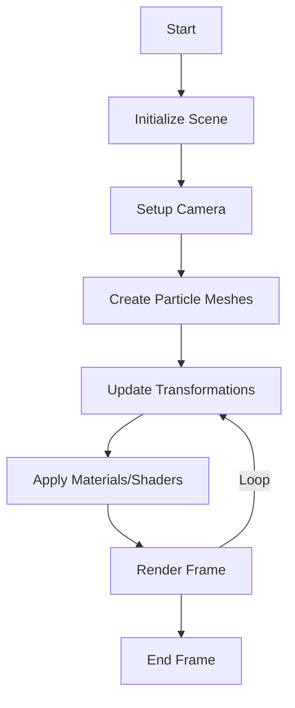

Yes, I can produce each of the recommended rendering system documents in sequence, using the provided GitHub repository (https://github.com/BTCEnoch/Protozoa/tree/main) as the source for the current project state and aligning with the new DDD structure outlined in `directory_map.md`. I’ll create each document one at a time, ensuring they are comprehensive, modular, and consistent with the project's goals. At the end of each document, I’ll ask, "Are you ready for the next document ([document_name].md)?" to confirm progression through the queue.

The list of documents to produce, in sequence, is:
1. `rendering_pipeline.md`
2. `shader_management.md`
3. `camera_controls.md`
4. `lod_implementation.md`
5. `instanced_rendering.md`
6. `rendering_debugging.md`
7. `scene_management.md`
8. `trait_integration.md`
9. `extending_rendering.md`
10. `performance_metrics.md`

Let’s start with the first document.

---


# Rendering Pipeline

## Purpose
This document provides a detailed overview of the rendering pipeline in Bitcoin Protozoa, outlining the sequence of steps from scene setup to final output. It serves as a single source of truth for developers, ensuring clarity in how creatures and particles are visualized using Three.js, and facilitates debugging and optimization by mapping out the pipeline’s stages.

## Location
`docs/rendering/rendering_pipeline.md`

## Overview
The rendering pipeline in Bitcoin Protozoa is responsible for transforming creature and particle data into a 3D visual representation. It leverages Three.js to manage the scene, camera, and rendering process, ensuring high performance (targeting 60 FPS for 500 particles per creature) and deterministic visuals. The pipeline integrates with the `creature` and `traits` domains to apply visual properties and is optimized for efficiency using techniques like instanced rendering.

## Pipeline Stages
The rendering pipeline consists of the following stages:

1. **Scene Initialization**
   - **Description**: Sets up the Three.js `Scene` object, including background, lighting, and initial objects.
   - **Components**: `sceneManager.ts` configures the scene with ambient and directional lights.
   - **Integration**: Pulls creature data from `src/domains/creature/` to populate the scene.

2. **Camera Setup**
   - **Description**: Configures the `PerspectiveCamera` and `OrbitControls` for user interaction.
   - **Components**: `cameraService.ts` manages camera properties and controls.
   - **Integration**: Uses canvas dimensions from the rendering context.

3. **Object Creation**
   - **Description**: Creates `InstancedMesh` objects for particles, applying geometries and materials.
   - **Components**: `particleRenderer.ts` generates meshes based on particle data.
   - **Integration**: Uses `IParticle` data from `src/domains/creature/types/particle.ts` and visual traits from `src/domains/traits/`.

4. **Transformation Updates**
   - **Description**: Updates particle positions, rotations, and scales based on creature state and formations.
   - **Components**: `particleRenderer.ts` modifies instance matrices for `InstancedMesh`.
   - **Integration**: Pulls formation data from `src/domains/traits/data/formationPatterns/`.

5. **Material and Shader Application**
   - **Description**: Applies materials and custom shaders to particles for visual effects (e.g., color, glow).
   - **Components**: `shaderManager.ts` manages shader uniforms and materials.
   - **Integration**: Uses visual traits from `src/domains/traits/services/visualService.ts`.

6. **Rendering Loop**
   - **Description**: Executes the rendering loop, updating the scene and camera, and drawing the frame.
   - **Components**: `sceneManager.ts` orchestrates the loop, calling `WebGLRenderer.render`.
   - **Integration**: Synchronizes with the game loop for real-time updates.

## Flowchart


## Integration Points
- **Creature Domain (`src/domains/creature/`)**: Provides `IParticle` and `ICreature` data for object creation and updates.
- **Traits Domain (`src/domains/traits/`)**: Supplies visual traits (e.g., color, glow) for material and shader application.
- **Shared Utilities (`src/shared/`)**: Uses types like `Role` and utilities for consistent data handling.

## Rules Adherence
- **Determinism**: Rendering is deterministic, relying on static creature and trait data, with no random visual changes.
- **Modularity**: The pipeline is encapsulated within the `rendering` domain, with clear interfaces for integration.
- **Performance**: Optimized using instanced rendering and efficient scene updates to meet the 60 FPS target.

## Migration Steps
To transition from the current GitHub structure (https://github.com/BTCEnoch/Protozoa/tree/main):
1. **Identify Existing Rendering Logic**: Locate Three.js rendering code (e.g., in `src/rendering/` or scattered files).
2. **Refactor into Pipeline Stages**: Move logic into appropriate services (`sceneManager.ts`, `cameraService.ts`, `particleRenderer.ts`, `shaderManager.ts`).
3. **Update Integration**: Ensure services integrate with `creature` and `traits` domains using the new DDD structure.
4. **Test Pipeline**: Validate that the pipeline renders creatures correctly, checking for visual consistency and performance using tools like Three.js’s `Stats`.

## Code Examples
### Scene Initialization
```typescript
// src/domains/rendering/services/sceneManager.ts
import * as THREE from 'three';

class SceneManager {
  private scene: THREE.Scene;

  constructor() {
    this.scene = new THREE.Scene();
    const ambientLight = new THREE.AmbientLight(0xffffff, 0.5);
    this.scene.add(ambientLight);
  }

  addObject(object: THREE.Object3D): void {
    this.scene.add(object);
  }
}

export const sceneManager = new SceneManager();
```

### Particle Rendering
```typescript
// src/domains/rendering/services/particleRenderer.ts
import * as THREE from 'three';

class ParticleRenderer {
  private mesh: THREE.InstancedMesh;

  constructor() {
    const geometry = new THREE.SphereGeometry(1, 16, 16);
    const material = new THREE.MeshBasicMaterial({ color: 0xffffff });
    this.mesh = new THREE.InstancedMesh(geometry, material, 500);
  }

  updateParticles(particles: IParticle[]) {
    const dummy = new THREE.Object3D();
    particles.forEach((p, i) => {
      dummy.position.set(p.position[0], p.position[1], p.position[2]);
      dummy.updateMatrix();
      this.mesh.setMatrixAt(i, dummy.matrix);
    });
    this.mesh.instanceMatrix.needsUpdate = true;
  }
}

export const particleRenderer = new ParticleRenderer();
```


