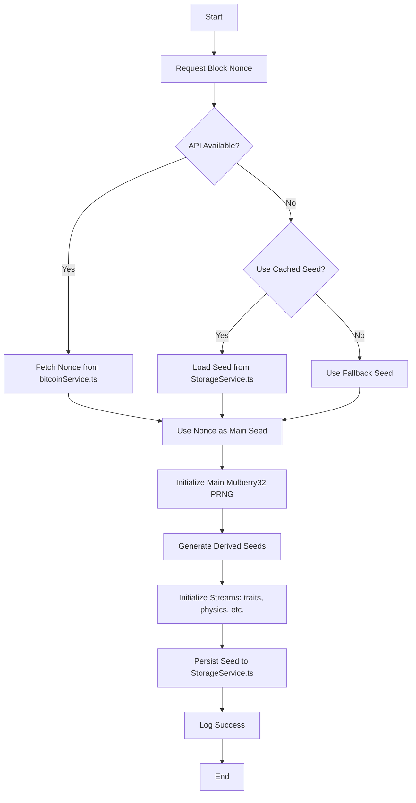
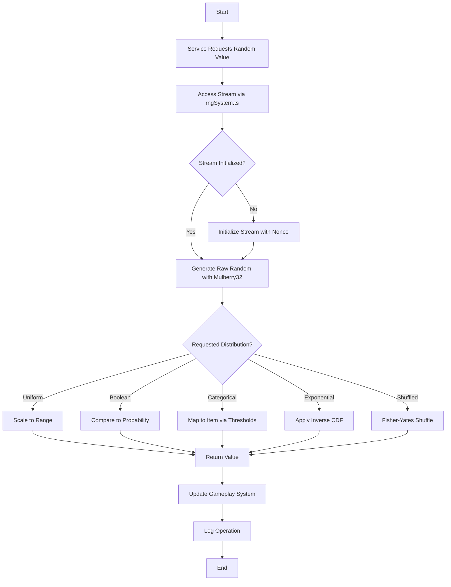
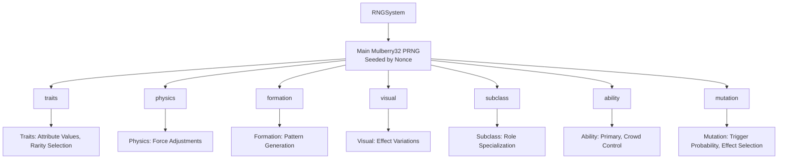
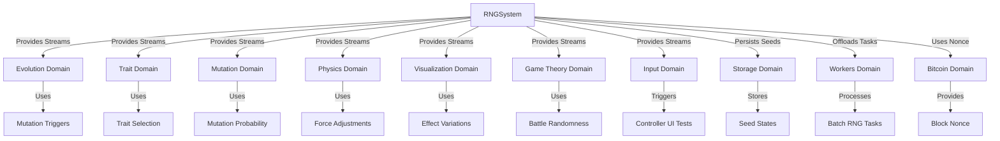

# RNG System Diagrams

## Purpose
This document provides visual aids to illustrate the structure, workflows, and interactions of the Random Number Generation (RNG) system in Bitcoin Protozoa, which generates deterministic pseudo-random numbers using the Mulberry32 algorithm seeded by the Bitcoin block nonce to drive unique creature generation per block. It serves as a single source of truth for developers, tailored to the project’s particle-based design with role-specific mechanics (CORE, CONTROL, MOVEMENT, DEFENSE, ATTACK), extensive trait system, and new DDD framework, ensuring clarity during migration from the current GitHub structure (https://github.com/BTCEnoch/Protozoa/tree/main).

## Location
`new_docs/systems/rng/rng_diagrams.md`

## Overview
The RNG system, implemented in `rngSystem.ts`, uses the Bitcoin block nonce to seed the Mulberry32 pseudo-random number generator (PRNG), producing deterministic sequences for mutation triggers, trait selection, and other gameplay mechanics, ensuring each block generates a unique but reproducible creature [Timestamp: April 4, 2025, 14:16; April 12, 2025, 12:18]. Supporting real-time performance (< 1ms per RNG call, 60 FPS) [Timestamp: April 14, 2025, 19:58], it integrates with evolution (`evolutionTracker.ts`), traits (`traitService.ts`), mutations (`mutationService.ts`), physics (`particleService.ts`), visualization (`visualService.ts`), input (`inputService.ts`), and game theory (`payoffMatrixService.ts`). This document includes flowcharts for seeding and distribution workflows, diagrams of stream hierarchies, and visuals of system interactions, using Mermaid syntax for clarity. It builds on our discussions about determinism, performance optimization, modularity, and controller UI integration for testing traits, behaviors, and formations [Timestamp: April 12, 2025, 12:18; April 15, 2025, 21:23; April 18, 2025, 14:25].

## Flowchart: Seeding Workflow
This flowchart illustrates the process of seeding the RNG system with the Bitcoin block nonce.



- **Description**: The workflow begins when `rngSystem.ts` requests a block nonce from `bitcoinService.ts` via an API (e.g., ordinals.com) [Timestamp: April 12, 2025, 12:18]. If the API is unavailable, it checks for a cached seed in `StorageService.ts` or uses a fallback seed (e.g., timestamp). The nonce is used directly as the main seed for the Mulberry32 PRNG, which generates derived seeds for streams (`traits`, `physics`, `formation`, `visual`, `subclass`, `ability`, `mutation`) [Timestamp: April 4, 2025, 14:16]. Streams are initialized with their respective Mulberry32 instances, the seed is persisted for replay, and success is logged, ensuring deterministic creature generation [Timestamp: April 16, 2025, 21:41].

## Flowchart: Distribution Workflow
This flowchart shows how random numbers are transformed into probability distributions for gameplay mechanics.



- **Description**: The workflow starts when a service (e.g., `mutationService.ts`) requests a random value from a stream (e.g., `mutation`) via `rngSystem.ts`. If the stream is uninitialized, it’s seeded with the block nonce [Timestamp: April 12, 2025, 12:18]. The stream’s Mulberry32 PRNG generates a raw [0, 1] random number, which is transformed into the requested distribution: uniform (scaled to range), boolean (probability check), categorical (threshold mapping), exponential (inverse CDF), or shuffled (Fisher-Yates) [Timestamp: April 4, 2025, 14:16]. The result drives gameplay (e.g., mutation trigger), is logged, and ensures deterministic outcomes.

## Diagram: Stream Hierarchy
This diagram illustrates the hierarchy of RNG streams in the system.



- **Description**: The RNG system, centered in `rngSystem.ts`, uses a main Mulberry32 PRNG seeded by the block nonce. This PRNG generates derived seeds for seven streams: `traits`, `physics`, `formation`, `visual`, `subclass`, `ability`, and `mutation`, each with a dedicated Mulberry32 instance [Timestamp: April 4, 2025, 14:16]. Streams handle specific tasks, such as trait rarity selection, physics force adjustments, or mutation triggers, ensuring separation of concerns and deterministic outcomes for creature generation [Timestamp: April 12, 2025, 12:18].

## Visual: RNG System Interactions
This diagram shows how the RNG system interacts with other domains.



- **Description**: The RNG system (`rngSystem.ts`) provides deterministic streams to the evolution domain (`evolutionTracker.ts`) for mutation triggers, trait domain (`traitService.ts`) for trait selection, mutation domain (`mutationService.ts`) for trigger probabilities, physics domain (`particleService.ts`) for force adjustments, visualization domain (`visualService.ts`) for effect variations, and game theory domain (`payoffMatrixService.ts`) for battle randomness [Timestamp: April 4, 2025, 14:16]. The input domain (`inputService.ts`, `controllerUIService.ts`) uses RNG for testing traits, behaviors, and formations via the controller UI [Timestamp: April 18, 2025, 14:25]. The storage domain (`StorageService.ts`) persists seeds for replay [Timestamp: April 16, 2025, 21:41], the workers domain (`computeWorker.ts`) offloads batch tasks [Timestamp: April 14, 2025, 19:58], and the Bitcoin domain (`bitcoinService.ts`) supplies nonce seeds [Timestamp: April 12, 2025, 12:18].

## Why Diagrams Are Important
- **Clarity**: Visuals simplify complex seeding and distribution workflows, making the RNG system accessible to developers [Timestamp: April 15, 2025, 21:23].
- **Alignment**: Diagrams ensure team members share a unified understanding of stream hierarchies and system interactions.
- **Scalability**: Highlight extension points (e.g., new streams, distribution types), supporting future enhancements.
- **Specificity**: Tailored to Bitcoin Protozoa’s deterministic, nonce-based design, ensuring unique creatures per block [Timestamp: April 12, 2025, 12:18].

## Integration Points
- **RNG Domain (`src/shared/services/`)**: `rngSystem.ts` manages seeding, streams, and distributions.
- **Bitcoin Domain (`src/domains/bitcoin/`)**: `bitcoinService.ts` provides nonce seeds [Timestamp: April 12, 2025, 12:18].
- **Storage Domain (`src/shared/services/`)**: `StorageService.ts` persists seeds for replay [Timestamp: April 16, 2025, 21:41].
- **Evolution Domain (`src/domains/evolution/`)**: `evolutionTracker.ts` uses streams for mutation triggers.
- **Trait Domain (`src/domains/traits/`)**: `traitService.ts` uses streams for trait selection.
- **Mutation Domain (`src/domains/mutation/`)**: `mutationService.ts` uses streams for trigger probabilities [Timestamp: April 12, 2025, 12:18].
- **Physics Domain (`src/domains/creature/`)**: `particleService.ts` uses streams for dynamic forces [Timestamp: April 8, 2025, 19:50].
- **Visualization Domain (`src/domains/visualization/`)**: `visualService.ts` uses streams for effect variations.
- **Game Theory Domain (`src/domains/gameTheory/`)**: `payoffMatrixService.ts` uses streams for battle randomness.
- **Input Domain (`src/domains/input/`)**: `inputService.ts` and `controllerUIService.ts` trigger streams for testing traits, behaviors, and formations [Timestamp: April 18, 2025, 14:25].
- **Workers Domain (`src/domains/workers/`)**: `computeWorker.ts` offloads RNG tasks [Timestamp: April 14, 2025, 19:58].

## Rules Adherence
- **Determinism**: Diagrams reflect nonce-based seeding for consistent creature generation [Timestamp: April 12, 2025, 12:18].
- **Modularity**: Visuals highlight encapsulated components (e.g., `rngSystem.ts`, streams) [Timestamp: April 15, 2025, 21:23].
- **Performance**: Workflows are optimized for < 1ms RNG calls, supporting 60 FPS [Timestamp: April 14, 2025, 19:58].
- **Integration**: Diagrams show connections to evolution, traits, mutations, physics, visualization, game theory, and controller UI [Timestamp: April 18, 2025, 14:25].

## Migration Steps
To transition from the current GitHub structure (https://github.com/BTCEnoch/Protozoa/tree/main):
1. **Identify Existing Logic**: Locate RNG-related code (e.g., in `src/lib/`), likely lacking nonce-based determinism [Timestamp: April 4, 2025, 14:16].
2. **Refactor into RNG Domain**: Move logic to `src/shared/services/rngSystem.ts`, updating diagrams to reflect DDD paths.
3. **Update Documentation**: Ensure diagrams reference `rngSystem.ts`, `bitcoinService.ts`, and stream-specific services.
4. **Test Visual Consistency**: Validate workflows match implemented behavior using Jest and visual inspections.

## Example Integration
The seeding workflow is implemented in `rngSystem.ts`:
```typescript
// src/shared/services/rngSystem.ts
class RNGSystem extends Singleton {
  async initializeStream(streamId: string, blockData?: IBlockData): Promise<void> {
    if (this.seedCache[streamId]) return;
    const data = blockData || await bitcoinService.fetchLatestBlock();
    const seed = data.nonce;
    this.seedCache[streamId] = seed;
    this.createStream(streamId, seed);
    await StorageService.save('rngState', streamId, { streamId, seed, blockHeight: data.height });
  }
}
```


