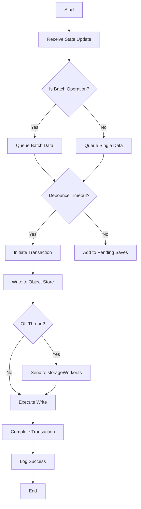
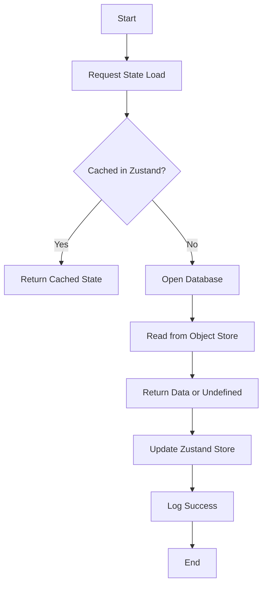
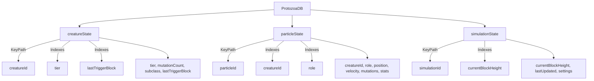
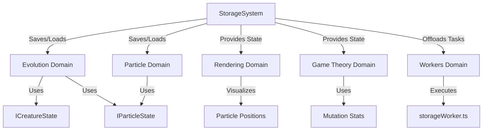

# Storage System Diagrams

## Purpose
This document provides visual aids to illustrate the structure, workflows, and interactions of the storage system in Bitcoin Protozoa, which manages persistent state for creatures, particles, and simulation progress using IndexedDB. It serves as a single source of truth for developers, tailored to the project’s particle-based design with role-specific mechanics (CORE, CONTROL, MOVEMENT, DEFENSE, ATTACK), deterministic RNG driven by Bitcoin block data, and new DDD framework, ensuring clarity during migration from the current GitHub structure (https://github.com/BTCEnoch/Protozoa/tree/main).

## Location
`new_docs/systems/storage/storage_diagrams.md`

## Overview
The storage system ensures continuity of evolutionary progress (e.g., mutation counts, tiers), particle states (e.g., positions, mutations), and simulation settings across sessions, using IndexedDB for persistence [Timestamp: April 16, 2025, 21:41]. Managed by `StorageService.ts` in the `shared` domain and integrated with Zustand stores (e.g., `evolutionStore.ts`) for in-memory state, it supports deterministic, performant operations (< 10ms writes, < 5ms reads, 60 FPS) [Timestamp: April 14, 2025, 19:58]. This document includes flowcharts for save and load workflows, diagrams of the database schema, and visuals of system interactions, using Mermaid syntax for clarity. It builds on our discussions about state persistence, performance optimization, and modularity [Timestamp: April 12, 2025, 12:18; April 15, 2025, 21:23].

## Flowchart: Save Workflow
This flowchart illustrates the process of saving state data to IndexedDB.



- **Description**: The workflow begins when a service (e.g., `evolutionTracker.ts`) triggers a state update (e.g., new mutation). The update is queued as a single or batch operation in `StorageService.ts`. A 100ms debounce consolidates rapid updates, reducing write frequency. A transaction is initiated to write data to the appropriate object store (`creatureState`, `particleState`, `simulationState`). For large batches, the write is offloaded to `storageWorker.ts` to avoid main thread blocking [Timestamp: April 14, 2025, 19:58]. The transaction completes, and success is logged, ensuring data persistence.

## Flowchart: Load Workflow
This flowchart shows how state data is retrieved from IndexedDB.



- **Description**: The workflow starts when a service (e.g., `evolutionTracker.ts`) requests state (e.g., creature state on session start). If the state is cached in a Zustand store (e.g., `evolutionStore.ts`), it’s returned immediately. Otherwise, `StorageService.ts` opens the `ProtozoaDB` database and reads from the specified object store using the key (e.g., `creatureId`). The retrieved data (or `undefined` if not found) is returned, used to update the Zustand store, and logged, ensuring state is available for gameplay.

## Diagram: Database Schema
This diagram illustrates the structure of the `ProtozoaDB` IndexedDB schema.



- **Description**: The `ProtozoaDB` database includes three object stores: `creatureState`, `particleState`, and `simulationState`. Each has a unique key path (`creatureId`, `particleId`, `simulationId`) for efficient access. Indexes (e.g., `tier`, `creatureId`) enable querying, while fields store critical data (e.g., `mutationCount`, `position`, `settings`). The schema supports scalability for 500 particles per creature and integrates with evolution and physics [Timestamp: April 16, 2025, 21:41].

## Visual: Storage System Interactions
This diagram shows how the storage system interacts with other domains.



- **Description**: The storage system (`StorageService.ts`) saves and loads `ICreatureState` and `IParticleState` for `evolutionTracker.ts` (evolution) and `particleService.ts` (particle). `instancedRenderer.ts` (rendering) uses loaded state for visuals, while `payoffMatrixService.ts` (game theory) leverages mutation stats. `storageWorker.ts` (workers) offloads batch writes, coordinated by `workerBridge.ts`, ensuring main thread performance [Timestamp: April 14, 2025, 19:58].

## Why Diagrams Are Important
- **Clarity**: Visuals simplify complex save/load workflows, making persistence operations accessible to developers [Timestamp: April 15, 2025, 21:23].
- **Alignment**: Diagrams ensure team members share a unified understanding of storage interactions and schema structure.
- **Scalability**: Highlight extension points (e.g., new object stores, indexes), supporting future enhancements.
- **Specificity**: Tailored to Bitcoin Protozoa’s deterministic, performance-driven design [Timestamp: April 12, 2025, 12:18].

## Integration Points
- **Storage Domain (`src/shared/services/`)**: `StorageService.ts` manages persistence, with `storageWorker.ts` for off-thread tasks.
- **Evolution Domain (`src/domains/evolution/`)**: `evolutionTracker.ts` persists `ICreatureState` and `IParticleState` [Timestamp: April 16, 2025, 21:41].
- **Particle Domain (`src/domains/creature/`)**: `particleService.ts` saves particle states.
- **Rendering Domain (`src/domains/rendering/`)**: `instancedRenderer.ts` uses loaded state for visuals.
- **Game Theory Domain (`src/domains/gameTheory/`)**: `payoffMatrixService.ts` leverages persistent state.
- **Workers Domain (`src/domains/workers/`)**: `storageWorker.ts` offloads batch writes, coordinated by `workerBridge.ts`.

## Rules Adherence
- **Determinism**: Diagrams reflect deterministic save/load processes using fixed key paths [Timestamp: April 12, 2025, 12:18].
- **Modularity**: Visuals highlight encapsulated components (e.g., `StorageService.ts`, `storageWorker.ts`) [Timestamp: April 15, 2025, 21:23].
- **Performance**: Workflows are optimized for < 10ms writes and < 5ms reads, supporting 60 FPS [Timestamp: April 14, 2025, 19:58].

## Migration Steps
To transition from the current GitHub structure (https://github.com/BTCEnoch/Protozoa/tree/main):
1. **Identify Existing Logic**: Locate state persistence code (e.g., in `src/creatures/` or `src/lib/`), likely using localStorage.
2. **Refactor into New Structure**: Move logic to `src/shared/services/StorageService.ts` and update diagrams to reflect DDD paths.
3. **Update Documentation**: Ensure diagrams reference new service names (e.g., `StorageService.ts`, `evolutionTracker.ts`).
4. **Test Visual Consistency**: Validate workflows match implemented behavior using Jest and visual inspections.

## Example Integration
The save workflow is implemented in `StorageService.ts`:
```typescript
// src/shared/services/StorageService.ts
class StorageService {
  async batchSave(store: 'particleState', data: any[]): Promise<void> {
    if (data.length > 100) {
      await workerBridge.sendMessage('storage', { task: 'batchSave', data: { store, items: data } });
    } else {
      const db = await this.getDB();
      const tx = db.transaction(store, 'readwrite');
      const objectStore = tx.objectStore(store);
      data.forEach(item => objectStore.put(item));
      await tx.done;
    }
  }
}
```

