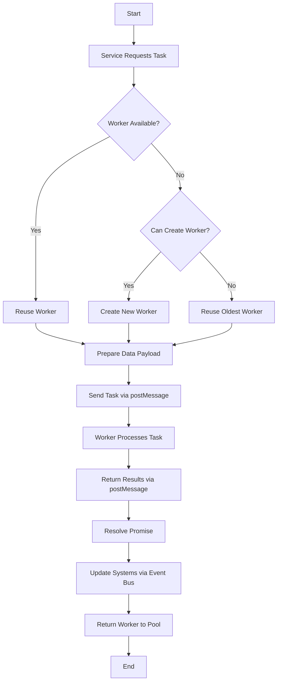
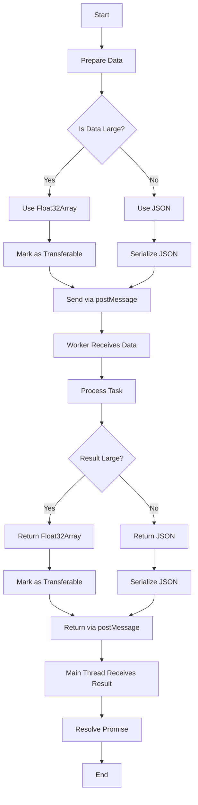
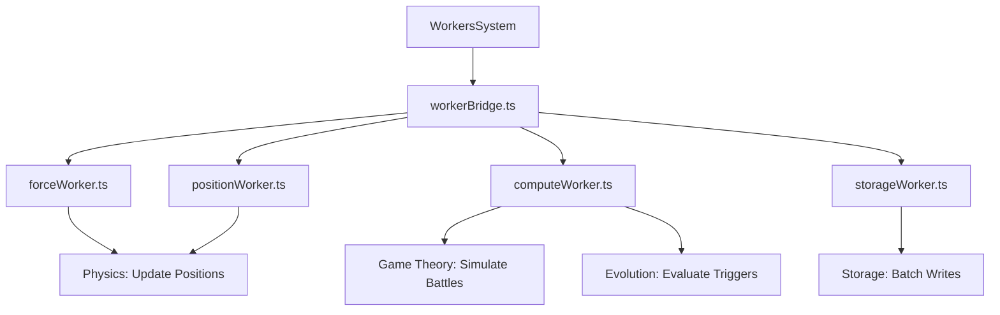
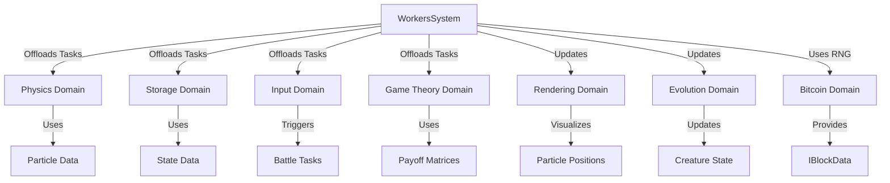

# Workers System Diagrams

## Purpose
This document provides visual aids to illustrate the structure, workflows, and interactions of the workers system in Bitcoin Protozoa, which offloads computationally intensive tasks to Web Workers for efficient processing. It serves as a single source of truth for developers, tailored to the project’s particle-based design with role-specific mechanics (CORE, CONTROL, MOVEMENT, DEFENSE, ATTACK), deterministic RNG driven by Bitcoin block data, and new DDD framework, ensuring clarity during migration from the current GitHub structure (https://github.com/BTCEnoch/Protozoa/tree/main).

## Location
`new_docs/systems/workers/workers_diagrams.md`

## Overview
The workers system enables Bitcoin Protozoa to perform tasks like physics calculations, game theory simulations, and storage operations off-thread, ensuring real-time performance (60 FPS, < 5ms task cycles) for up to 500 particles [Timestamp: April 14, 2025, 19:58]. Managed by `workerBridge.ts` and executed by workers such as `forceWorker.ts`, `computeWorker.ts`, and `storageWorker.ts`, it integrates with physics (`particleService.ts`), storage (`StorageService.ts`), input (`inputService.ts`), and game theory (`payoffMatrixService.ts`). This document includes flowcharts for task offloading and data transfer workflows, diagrams of worker hierarchies, and visuals of system interactions, using Mermaid syntax for clarity. It builds on our discussions about performance optimization, determinism, and modularity [Timestamp: April 12, 2025, 12:18; April 15, 2025, 21:23].

## Flowchart: Task Offloading Workflow
This flowchart illustrates the process of offloading tasks to Web Workers.



- **Description**: The workflow begins when a service (e.g., `particleService.ts`) requests a task via `workerBridge.ts`. `workerBridge.ts` checks for an available worker in the pool for the task type (e.g., `force`). If none is available and the pool is below the limit (4 workers), a new worker is created; otherwise, the oldest worker is reused. The data payload (e.g., `IParticle[]`) is prepared, often as a `Float32Array`, and sent to the worker via `postMessage` with `Transferable` objects. The worker processes the task (e.g., calculates forces) and returns results, which `workerBridge.ts` resolves as a promise. Results update systems (e.g., rendering, evolution) via `eventBus.ts`, and the worker is returned to the pool [Timestamp: April 14, 2025, 19:58].

## Flowchart: Data Transfer Workflow
This flowchart shows how data is transferred between the main thread and Web Workers.



- **Description**: The workflow starts with data preparation in the requesting service (e.g., `particleService.ts`). Large datasets (e.g., 500 particles’ positions) are formatted as `Float32Array` and marked as `Transferable` to avoid copying, while small data (e.g., creature IDs) uses JSON. Data is sent via `postMessage` to the worker, which receives and processes it. Results follow the same logic: large results (e.g., force vectors) use `Float32Array` with `Transferable`, small results use JSON. The main thread receives results, resolves the promise, and updates systems, ensuring < 1ms transfer times [Timestamp: April 14, 2025, 19:58].

## Diagram: Worker Hierarchy
This diagram illustrates the hierarchy of Web Workers in the workers system.



- **Description**: The workers system is orchestrated by `workerBridge.ts`, which manages four worker types: `forceWorker.ts` and `positionWorker.ts` for physics tasks (e.g., force calculations, position updates) [Timestamp: April 8, 2025, 19:50], `computeWorker.ts` for game theory simulations and evolution triggers, and `storageWorker.ts` for batch IndexedDB writes [Timestamp: April 16, 2025, 21:41]. Each worker handles specific tasks, ensuring modularity and scalability [Timestamp: April 15, 2025, 21:23].

## Visual: Workers System Interactions
This diagram shows how the workers system interacts with other domains.



- **Description**: The workers system (`workerBridge.ts`) offloads tasks to the physics domain (`particleService.ts`) for particle calculations, the storage domain (`StorageService.ts`) for state persistence, the input domain (`inputService.ts`) for user-driven tasks (e.g., battles), and the game theory domain (`payoffMatrixService.ts`) for simulations. Results update the rendering domain (`instancedRenderer.ts`) for visualizations and the evolution domain (`evolutionTracker.ts`) for state changes. The Bitcoin domain (`bitcoinService.ts`) provides `IBlockData` for RNG seeding, ensuring deterministic outcomes [Timestamp: April 12, 2025, 12:18].

## Why Diagrams Are Important
- **Clarity**: Visuals simplify complex task offloading and data transfer workflows, making the workers system accessible [Timestamp: April 15, 2025, 21:23].
- **Alignment**: Diagrams ensure team members share a unified understanding of worker interactions and task hierarchies.
- **Scalability**: Highlight extension points (e.g., new worker types, tasks), supporting future enhancements.
- **Specificity**: Tailored to Bitcoin Protozoa’s deterministic, performance-driven design [Timestamp: April 12, 2025, 12:18].

## Integration Points
- **Workers Domain (`src/domains/workers/`)**: `workerBridge.ts` coordinates tasks for `forceWorker.ts`, `positionWorker.ts`, `computeWorker.ts`, and `storageWorker.ts`.
- **Physics Domain (`src/domains/creature/`)**: `particleService.ts` offloads physics calculations [Timestamp: April 8, 2025, 19:50].
- **Storage Domain (`src/shared/services/`)**: `StorageService.ts` offloads batch writes [Timestamp: April 16, 2025, 21:41].
- **Input Domain (`src/domains/input/`)**: `inputService.ts` triggers offloaded tasks.
- **Game Theory Domain (`src/domains/gameTheory/`)**: `payoffMatrixService.ts` offloads calculations.
- **Rendering Domain (`src/domains/rendering/`)**: `instancedRenderer.ts` uses worker results.
- **Evolution Domain (`src/domains/evolution/`)**: `evolutionTracker.ts` processes worker results.
- **Bitcoin Domain (`src/domains/bitcoin/`)**: `bitcoinService.ts` provides `IBlockData` for RNG seeding [Timestamp: April 12, 2025, 12:18].

## Rules Adherence
- **Determinism**: Diagrams reflect deterministic task offloading and data transfers with fixed mappings [Timestamp: April 12, 2025, 12:18].
- **Modularity**: Visuals highlight encapsulated components (e.g., `workerBridge.ts`, `forceWorker.ts`) [Timestamp: April 15, 2025, 21:23].
- **Performance**: Workflows are optimized for < 5ms task execution, < 1ms transfers, and 60 FPS [Timestamp: April 14, 2025, 19:58].

## Migration Steps
To transition from the current GitHub structure (https://github.com/BTCEnoch/Protozoa/tree/main):
1. **Identify Existing Logic**: Locate computation-related code (e.g., in `src/creatures/` or `src/lib/`), likely main-thread-based.
2. **Refactor into Workers Domain**: Move logic to `src/domains/workers/` and update diagrams to reflect DDD paths.
3. **Update Documentation**: Ensure diagrams reference new service names (e.g., `workerBridge.ts`, `forceWorker.ts`).
4. **Test Visual Consistency**: Validate workflows match implemented behavior using Jest and visual inspections.

## Example Integration
The task offloading workflow is implemented in `workerBridge.ts`:
```typescript
// src/domains/workers/services/workerBridge.ts
class WorkerBridge extends Singleton {
  async sendMessage(workerType: string, data: any): Promise<any> {
    const worker = this.getWorker(workerType);
    return new Promise((resolve, reject) => {
      worker.onmessage = (e: MessageEvent) => {
        this.workerPool[workerType].push(worker);
        resolve(e.data);
      };
      worker.onerror = (e: ErrorEvent) => reject(e);
      worker.postMessage(data, [data.buffer].filter(Boolean));
    });
  }
}
```


